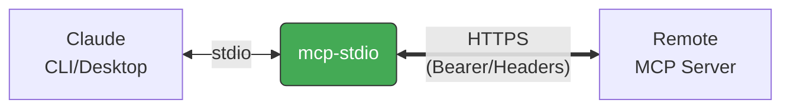

# mcp-stdio

[English](README.md) | 日本語

MCP サーバー向け stdio-to-HTTP リレー — Claude Desktop/Code とリモート Streamable HTTP エンドポイントを橋渡しします。

## なぜ必要？

[MCP](https://modelcontextprotocol.io/) クライアント（Claude Desktop, Claude Code）に対してローカルで稼働するセルフホスト MCP サーバのように振る舞いつつ、リモート MCP サーバへの Streamable HTTP 接続を橋渡しします：



Bearer token やカスタムヘッダーをリモートサーバーへ転送します。

## インストール

```bash
pip install mcp-stdio
```

[uv](https://docs.astral.sh/uv/) を使う場合：

```bash
uv tool install mcp-stdio
```

インストールせずに直接実行：

```bash
uvx mcp-stdio https://your-server.example.com:8080/mcp
```

[Homebrew](https://brew.sh/) を使う場合：

```bash
brew install shigechika/tap/mcp-stdio
```

## クイックスタート

```bash
mcp-stdio https://your-server.example.com:8080/mcp
```

Bearer token 認証付き：

```bash
# 推奨: 環境変数を使用（トークンが `ps` に表示されない）
MCP_BEARER_TOKEN=YOUR_TOKEN mcp-stdio https://your-server.example.com:8080/mcp

# または直接指定（トークンが `ps` の出力に表示される）
mcp-stdio https://your-server.example.com:8080/mcp --bearer-token YOUR_TOKEN
```

カスタムヘッダー付き：

```bash
mcp-stdio https://your-server.example.com:8080/mcp -H "X-API-Key: YOUR_KEY"
```

## Claude Desktop の設定

`claude_desktop_config.json` に追加：

```json
{
  "mcpServers": {
    "my-remote-server": {
      "command": "mcp-stdio",
      "args": ["https://your-server.example.com:8080/mcp"],
      "env": {
        "MCP_BEARER_TOKEN": "YOUR_TOKEN"
      }
    }
  }
}
```

設定ファイルの場所：
- macOS: `~/Library/Application Support/Claude/claude_desktop_config.json`
- Windows: `%APPDATA%\Claude\claude_desktop_config.json`
- Linux: `~/.config/Claude/claude_desktop_config.json`

## Claude Code の設定

```bash
claude mcp add my-remote-server \
  -e MCP_BEARER_TOKEN=YOUR_TOKEN \
  -- mcp-stdio https://your-server.example.com:8080/mcp
```

## 使い方

```
mcp-stdio [OPTIONS] URL

引数:
  URL                    リモート MCP サーバーの URL

オプション:
  --bearer-token TOKEN   Bearer token（MCP_BEARER_TOKEN 環境変数でも指定可）
  -H 'Key: Value'        カスタムヘッダー（複数指定可）
  --timeout-connect SEC  接続タイムアウト（デフォルト: 10秒）
  --timeout-read SEC     読み取りタイムアウト（デフォルト: 120秒）
  -V, --version          バージョン表示
  -h, --help             ヘルプ表示
```

## 機能

- **バックオフ付きリトライ** — 接続エラー時に最大3回リトライ
- **セッション回復** — 404 でセッション ID をリセットして再試行
- **Bearer token 認証** — `--bearer-token` フラグまたは `MCP_BEARER_TOKEN` 環境変数
- **カスタムヘッダー** — `-H` で任意のヘッダーを送信（[#28293](https://github.com/anthropics/claude-code/issues/28293), [#39271](https://github.com/anthropics/claude-code/issues/39271) のワークアラウンド）
- **グレースフルシャットダウン** — SIGTERM/SIGINT ハンドリング
- **最小依存** — [httpx](https://www.python-httpx.org/) のみ

## 仕組み

1. stdin から JSON-RPC メッセージを読み取り（Claude Desktop/Code が送信）
2. HTTP POST でリモート MCP サーバーに転送
3. レスポンス（JSON または SSE）をパースして stdout に書き出し
4. `Mcp-Session-Id` ヘッダーをリクエスト間で維持

## ライセンス

MIT
