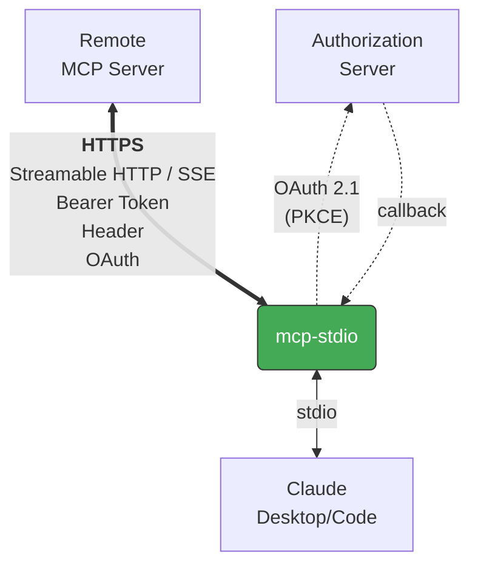

# mcp-stdio

[English](README.md) | 日本語

Stdio-to-HTTP ゲートウェイ — MCP クライアントとリモート HTTP MCP サーバーを接続します。

## 概要

[MCP](https://modelcontextprotocol.io/) クライアント（Claude Desktop, Claude Code）に対してローカルで稼働するセルフホスト MCP サーバのように振る舞いつつ、各種認証でリモート MCP サーバーへの接続を橋渡しします：



Bearer token、カスタムヘッダー、OAuth 2.1 認証情報をリモートサーバーへ転送します。

## 特徴

- **両 MCP トランスポート対応** — Streamable HTTP（現行仕様、デフォルト）と SSE（MCP 2024-11-05 レガシー）を `--transport` で切り替え。SSE パーサは [WHATWG Server-Sent Events 仕様](https://html.spec.whatwg.org/multipage/server-sent-events.html) に準拠。
- **OAuth 2.1 クライアント** — 認可コードフロー（PKCE）、動的クライアント登録、トークンリフレッシュ、安全なトークン永続化を内蔵。MCP 認可仕様の関連 RFC にセクション単位で対応：
  - [RFC 9728](https://www.rfc-editor.org/rfc/rfc9728) Protected Resource Metadata
    - §3 `/.well-known/oauth-protected-resource` による認可サーバー検出
    - §3.1 パスベースのリバースプロキシ配下に対応した well-known URL 構築（ホストルートへのフォールバック付き）。リソース URL の query component も構築後の metadata URL に保持する
    - §3.3 `resource` フィールド検証（不一致は警告して続行）
  - [RFC 8414](https://www.rfc-editor.org/rfc/rfc8414) Authorization Server Metadata
    - §3 well-known URL 構築。パス付き issuer のパス挿入ルール対応
    - §3 `issuer` 検証（不一致は警告して続行）
  - [RFC 8707](https://www.rfc-editor.org/rfc/rfc8707) Resource Indicators
    - §2 `resource` パラメータを認可リクエスト・トークン交換・**リフレッシュ**に送信
  - [RFC 7636](https://www.rfc-editor.org/rfc/rfc7636) PKCE
    - §4.1–4.2 S256 `code_challenge_method`、96 文字の `code_verifier`
  - [RFC 7591](https://www.rfc-editor.org/rfc/rfc7591) Dynamic Client Registration
    - §3 クライアント登録リクエスト（公開クライアント、`token_endpoint_auth_method: none`）
    - §3.2.1 `client_secret_expires_at` に対応、期限切れ時に自動再登録
  - [RFC 6750](https://www.rfc-editor.org/rfc/rfc6750) Bearer Token の利用
    - §2.1 `Authorization: Bearer <token>` リクエストヘッダー
- **バックオフ付きリトライ** — 接続エラー時に最大3回リトライ
- **ストリーミング耐性** — SSE レスポンスをリアルタイムで転送、ストリーム切断時に自動再接続
- **セッション回復** — 404 でセッション ID をリセットして再試行
- **401 時の自動トークンリフレッシュ** — セッション中に OAuth トークンが失効しても自動更新
- **Bearer token 認証** — `--bearer-token` フラグまたは `MCP_BEARER_TOKEN` 環境変数
- **カスタムヘッダー** — `-H` / `--header` で任意のヘッダーを送信
- **グレースフルシャットダウン** — SIGTERM/SIGINT ハンドリング
- **プロキシ対応** — `HTTP_PROXY`, `HTTPS_PROXY`, `NO_PROXY` 環境変数を [httpx](https://www.python-httpx.org/) 経由でサポート
- **最小依存** — [httpx](https://www.python-httpx.org/) のみ; OAuth は stdlib のみ使用

## インストール

```bash
pip install mcp-stdio
```

[uv](https://docs.astral.sh/uv/) を使う場合：

```bash
uv tool install mcp-stdio
```

インストールせずに直接実行：

```bash
uvx mcp-stdio https://your-server.example.com:8080/mcp
```

[Homebrew](https://brew.sh/) を使う場合：

```bash
brew install shigechika/tap/mcp-stdio
```

## クイックスタート

```bash
mcp-stdio https://your-server.example.com:8080/mcp
```

Bearer token 認証付き：

```bash
# 推奨: 環境変数を使用（トークンが `ps` に表示されない）
MCP_BEARER_TOKEN=YOUR_TOKEN mcp-stdio https://your-server.example.com:8080/mcp

# または直接指定（トークンが `ps` の出力に表示される）
mcp-stdio https://your-server.example.com:8080/mcp --bearer-token YOUR_TOKEN
```

カスタムヘッダー付き：

```bash
mcp-stdio https://your-server.example.com:8080/mcp --header "X-API-Key: YOUR_KEY"
```

OAuth 2.1 認証付き（OAuth 必須のサーバー向け）：

```bash
mcp-stdio --oauth https://your-server.example.com:8080/mcp

# 事前登録済みクライアント ID を使用（動的クライアント登録をスキップ）
mcp-stdio --oauth --client-id YOUR_CLIENT_ID https://your-server.example.com:8080/mcp
```

MCP 2024-11-05 レガシーの SSE トランスポートを使うサーバー向け：

```bash
mcp-stdio --transport sse https://your-server.example.com:8080/sse
```

接続確認：

```bash
mcp-stdio --check https://your-server.example.com:8080/mcp
```

## Claude Desktop の設定

`claude_desktop_config.json` に追加：

```json
{
  "mcpServers": {
    "my-remote-server": {
      "command": "mcp-stdio",
      "args": ["https://your-server.example.com:8080/mcp"],
      "env": {
        "MCP_BEARER_TOKEN": "YOUR_TOKEN"
      }
    }
  }
}
```

設定ファイルの場所：
- macOS: `~/Library/Application Support/Claude/claude_desktop_config.json`
- Windows: `%APPDATA%\Claude\claude_desktop_config.json`
- Linux: `~/.config/Claude/claude_desktop_config.json`

## Claude Code の設定

```bash
claude mcp add my-remote-server \
  -e MCP_BEARER_TOKEN=YOUR_TOKEN \
  -- mcp-stdio https://your-server.example.com:8080/mcp
```

## 使い方

```
mcp-stdio [OPTIONS] URL

引数:
  URL                    リモート MCP サーバーの URL

オプション:
  --bearer-token TOKEN   Bearer token（MCP_BEARER_TOKEN 環境変数でも指定可）
  --oauth                OAuth 2.1 認証を有効化
  --client-id ID         事前登録済み OAuth クライアント ID（MCP_OAUTH_CLIENT_ID 環境変数でも指定可）
  --oauth-scope SCOPE    要求する OAuth スコープ
  -H, --header 'Key: Value'  カスタムヘッダー（複数指定可）
  --transport {streamable-http,sse}
                         トランスポート種別（デフォルト: streamable-http）
  --timeout-connect SEC  接続タイムアウト（デフォルト: 10秒）
  --timeout-read SEC     読み取りタイムアウト（デフォルト: 120秒）
  --check                接続確認して終了
  -V, --version          バージョン表示
  -h, --help             ヘルプ表示
```

## ワークアラウンド

### Claude Code

Claude Code の HTTP transport の既知の問題を回避できます：

- **Bearer token が送信されない** — ツール呼び出し時に `Authorization` ヘッダーが無視される（[#28293](https://github.com/anthropics/claude-code/issues/28293), [#33817](https://github.com/anthropics/claude-code/issues/33817)）
- **Accept ヘッダーの欠落** — サーバーが 406 を返し、認証エラーと誤認される（[#42470](https://github.com/anthropics/claude-code/issues/42470)）
- **OAuth フォールバックループ** — OAuth 不要なサーバーでも OAuth 検出が走る（[#34008](https://github.com/anthropics/claude-code/issues/34008), [#39271](https://github.com/anthropics/claude-code/issues/39271)）
- **切断後にセッションが失われる** — mcp-stdio は 404 で MCP セッションを自動回復（[#34498](https://github.com/anthropics/claude-code/issues/34498), [#38631](https://github.com/anthropics/claude-code/issues/38631)）
- **OAuth scope が送信されない** — 認可リクエストに `scope` パラメータが含まれず、厳格な OAuth サーバーがフローを拒否する（[#4540](https://github.com/anthropics/claude-code/issues/4540)）; mcp-stdio は `--oauth-scope` でスコープを送信
- **プロキシ設定が無視される** — Claude Code が `NO_PROXY` を尊重しない（[#34804](https://github.com/anthropics/claude-code/issues/34804)）; mcp-stdio は httpx 経由でプロキシ設定を継承
- **`prompt=consent` が authorize URL に無条件付与** — Claude Code v2.1.109 は OAuth の authorize リクエストに `prompt=consent` を常に付けるため、ユーザー同意を無効化した Microsoft Entra ID テナント（企業で一般的）では、管理者がテナント全体の同意を付与済みでもサインイン完了できない（[#49722](https://github.com/anthropics/claude-code/issues/49722)）; mcp-stdio は authorize リクエストに `prompt=` を含めず、認可サーバー側の現行同意状態に応じて同意 UI の要否を判断させる
- **`tools/list` ページネーションを無視** — Claude Code は最初の `tools/list` 応答しか受けず `nextCursor` を黙って捨てるため、2 ページ目以降の tool が見えない（MCP gateway や大規模ツールカタログが壊れる）（[#39586](https://github.com/anthropics/claude-code/issues/39586)）; mcp-stdio は `tools/list` / `resources/list` / `resources/templates/list` / `prompts/list` の `nextCursor` を透過的に追跡し、1 つの応答にマージして返す
- **403 `insufficient_scope` の step-up が動かない** — tool 単位で広い scope を要求するサーバーが 403 に `WWW-Authenticate: Bearer error="insufficient_scope", scope="..."` を付けて返しても、Claude Code は Protected Resource Metadata を取り直すだけで新しいトークンを要求せず、段階的 scope のサーバーが事実上使えない（[#44652](https://github.com/anthropics/claude-code/issues/44652)）; mcp-stdio は challenge を解析し、既存 scope ∪ challenge scope で RFC 9470 step-up 認可フローを回し（キャッシュ済みクライアントを再利用、DCR はやり直さない）、元のリクエストを自動リトライする

### mcp-remote

- **パス付き auth server で OAuth 検出が失敗する** — RFC 8414 §3 のパス挿入ルール未実装のため、auth server URL にパスが含まれるサーバー（マルチテナント・Keycloak 等）で検出が失敗する（[mcp-remote#207](https://github.com/geelen/mcp-remote/issues/207)）; mcp-stdio は正しい well-known URL を構築する
- **パスベースのリバースプロキシ配下の MCP サーバーで OAuth 検出が失敗する** — サブパスにマウントされた MCP サーバー（Tailscale serve、nginx `location /mcp/` 等）では、RFC 9728 §3.1 に従い Protected Resource Metadata を `/.well-known/oauth-protected-resource/{path}` から取得する必要がある（ホストルートでは 404）（[mcp-remote#249](https://github.com/geelen/mcp-remote/issues/249)）; mcp-stdio はパス挿入した URL を先に試し、ホストルートにフォールバックする
- **access / refresh 両方失効時の再認証ループ** — 長期未使用やサーバー側失効で両トークンが無効になると、mcp-remote は localhost コールバックで認可コードを受信するものの新トークン交換を行わず、ログイン画面のループに陥る（[mcp-remote#256](https://github.com/geelen/mcp-remote/issues/256)）; mcp-stdio はリフレッシュ失敗時にキャッシュを破棄し、full flow を認可コード交換まで完走させる

### Windows

- **stdio の CRLF 変換** — Python のデフォルトの `TextIOWrapper` は Windows で `\n` を `\r\n` に変換してしまい、MCP が使う NDJSON ワイヤーフォーマットを壊す。mcp-stdio は `sys.stdin`/`sys.stdout` を素の LF モードに設定し直して、ホスト OS に関係なくメッセージが仕様に沿うようにしている（`stdio_server` における同種のバグは [modelcontextprotocol/python-sdk#2433](https://github.com/modelcontextprotocol/python-sdk/issues/2433) を参照）。

## 仕組み

1. `--oauth` 指定時、アクセストークンを取得（キャッシュ → リフレッシュ → ブラウザ認証）
2. stdin から JSON-RPC メッセージを読み取り（Claude Desktop/Code が送信）
3. HTTPS でリモート MCP サーバーへ転送
4. レスポンスをパースして stdout に書き出し
5. 401 で OAuth トークンをリフレッシュしてリトライ

トランスポート別の挙動：

- **Streamable HTTP**（デフォルト）— 各メッセージを単一 POST で送信。`Mcp-Session-Id` ヘッダーでセッション状態を追跡し、404 時は自動で再初期化。
- **SSE**（MCP 2024-11-05 レガシー）— 持続的な `GET` ストリームで応答と初回の `endpoint` イベント（POST 先 URL）を受信。ストリーム切断時は自動再接続。

OAuth トークンは `~/.config/mcp-stdio/tokens.json` に保存されます（パーミッション 0600）。

## ライセンス

MIT
