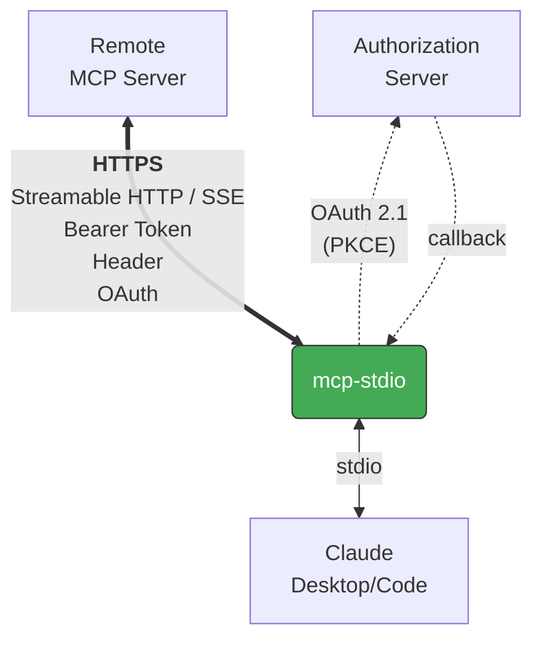

# mcp-stdio

[English](README.md) | 日本語

Stdio-to-HTTP ゲートウェイ — MCP クライアントとリモート HTTP MCP サーバーを接続します。

## 概要

[MCP](https://modelcontextprotocol.io/) クライアント（Claude Desktop, Claude Code）に対してローカルで稼働するセルフホスト MCP サーバのように振る舞いつつ、各種認証でリモート MCP サーバーへの接続を橋渡しします：


```mermaid
flowchart BT
    A[Claude<br>Desktop/Code] <-- stdio --> B(mcp-stdio)
    B <== "<b>HTTPS</b><br>Streamable HTTP / SSE<br>Bearer Token<br>Header<br>OAuth" ==> C[Remote<br>MCP Server]
    B -. "OAuth 2.1<br>(PKCE)" .-> D[Authorization<br>Server]
    D -. callback .-> B
    style B fill:#4a5,stroke:#333,color:#fff
```

Bearer token、カスタムヘッダー、OAuth 2.1 認証情報をリモートサーバーへ転送します。

## 特徴

- **両 MCP トランスポート対応** — Streamable HTTP（現行仕様、デフォルト）と SSE（MCP 2024-11-05 レガシー）を `--transport` で切り替え。SSE パーサは [WHATWG Server-Sent Events 仕様](https://html.spec.whatwg.org/multipage/server-sent-events.html) に準拠。
- **OAuth 2.1 クライアント** — 認可コードフロー（PKCE）、動的クライアント登録、トークンリフレッシュ、安全なトークン永続化を内蔵。MCP 認可仕様の関連 RFC にセクション単位で対応：
  - [RFC 9728](https://www.rfc-editor.org/rfc/rfc9728) Protected Resource Metadata
    - §3 `/.well-known/oauth-protected-resource` による認可サーバー検出
    - §3.1 パスベースのリバースプロキシ配下に対応した well-known URL 構築（ホストルートへのフォールバック付き）。リソース URL の query component も構築後の metadata URL に保持する
    - §3.3 `resource` フィールド検証（不一致は警告して続行）
    - §5.1 `WWW-Authenticate: Bearer resource_metadata=` ヒント — discovery 前にサーバーへ probe を送り、well-known パスの推測に頼らず PRM の所在を直接特定する
  - [RFC 8414](https://www.rfc-editor.org/rfc/rfc8414) Authorization Server Metadata
    - §3 well-known URL 構築。パス付き issuer のパス挿入ルール対応
    - §3 `issuer` 検証（不一致は警告して続行）
  - [RFC 8707](https://www.rfc-editor.org/rfc/rfc8707) Resource Indicators
    - §2 `resource` パラメータを認可リクエスト・トークン交換・**リフレッシュ**に送信
  - [RFC 7636](https://www.rfc-editor.org/rfc/rfc7636) PKCE
    - §4.1–4.2 S256 `code_challenge_method`、約 86 文字の `code_verifier`
  - [RFC 8628](https://www.rfc-editor.org/rfc/rfc8628) Device Authorization Grant
    - §3.1 `resource` インジケータ付きデバイス認可リクエスト（RFC 8707）
    - §3.4–3.5 `authorization_pending` / `slow_down`（interval +=5 s）/ `expired_token` / `access_denied` ハンドリング
    - DCR の `grant_types` に `urn:ietf:params:oauth:grant-type:device_code` を登録（RFC 7591 §2）
  - [RFC 7591](https://www.rfc-editor.org/rfc/rfc7591) Dynamic Client Registration
    - §3 クライアント登録リクエスト。AS メタデータの `token_endpoint_auth_methods_supported` から最適な認証方式を選択（`none` → `client_secret_post` → `client_secret_basic` の優先順）
    - §3.2.1 `client_secret_expires_at` に対応、期限切れ時に自動再登録
  - [RFC 6749](https://www.rfc-editor.org/rfc/rfc6749) OAuth 2.0
    - §2.3.1 `client_secret_basic`：percent-encode した認証情報を `Authorization: Basic` ヘッダーで送信（コード交換・トークンリフレッシュ・Device Authorization Grant ポーリングに適用）
  - [RFC 6750](https://www.rfc-editor.org/rfc/rfc6750) Bearer Token の利用
    - §2.1 `Authorization: Bearer <token>` リクエストヘッダー
- **バックオフ付きリトライ** — 接続エラー時に最大3回リトライ
- **ストリーミング耐性** — SSE レスポンスをリアルタイムで転送、ストリーム切断時に自動再接続
- **行区切り文字の安全化** — 上流レスポンス中の生の `U+2028` / `U+2029`（JSON では合法だが JavaScript の行終端文字）をエスケープし、これらを改行として扱うクライアントによるフレーム崩れを防止。ロスレス（cf. modelcontextprotocol/typescript-sdk#2155）
- **セッション回復** — 404 でセッション ID をリセットして再試行
- **プロトコルバージョンヘッダー** — `initialize` 応答から交渉済みの `protocolVersion` を捕捉し、以降の Streamable HTTP リクエストすべてに `MCP-Protocol-Version` を付与（MCP 仕様 rev 2025-06-18）。このヘッダーを強制するサーバーは未送信時に初期化後リクエストを `400 Bad Request` で拒否する
- **401 時の自動トークンリフレッシュ** — セッション中に OAuth トークンが失効しても自動更新
- **Bearer token 認証** — `--bearer-token` フラグまたは `MCP_BEARER_TOKEN` 環境変数
- **カスタムヘッダー** — `-H` / `--header` で任意のヘッダーを送信
- **グレースフルシャットダウン** — SIGTERM/SIGINT ハンドリング
- **プロキシ対応** — `HTTP_PROXY`, `HTTPS_PROXY`, `NO_PROXY` 環境変数を [httpx](https://www.python-httpx.org/) 経由でサポート
- **最小依存** — [httpx](https://www.python-httpx.org/) のみ; OAuth は stdlib のみ使用

## インストール

```bash
pip install mcp-stdio
```

[uv](https://docs.astral.sh/uv/) を使う場合：

```bash
uv tool install mcp-stdio
```

インストールせずに直接実行：

```bash
uvx mcp-stdio https://your-server.example.com:8080/mcp
```

[Homebrew](https://brew.sh/) を使う場合：

```bash
brew install shigechika/tap/mcp-stdio
```

## クイックスタート

```bash
mcp-stdio https://your-server.example.com:8080/mcp
```

Bearer token 認証付き：

```bash
# 推奨: 環境変数を使用（トークンが `ps` に表示されない）
MCP_BEARER_TOKEN=YOUR_TOKEN mcp-stdio https://your-server.example.com:8080/mcp

# または直接指定（トークンが `ps` の出力に表示される）
mcp-stdio https://your-server.example.com:8080/mcp --bearer-token YOUR_TOKEN
```

カスタムヘッダー付き：

```bash
mcp-stdio https://your-server.example.com:8080/mcp --header "X-API-Key: YOUR_KEY"
```

OAuth 2.1 認証付き（OAuth 必須のサーバー向け）：

```bash
mcp-stdio --oauth https://your-server.example.com:8080/mcp

# 事前登録済みクライアント ID を使用（動的クライアント登録をスキップ）
mcp-stdio --oauth --client-id YOUR_CLIENT_ID https://your-server.example.com:8080/mcp
```

OAuth 2.1 Device Authorization Grant（RFC 8628）— SSH・ヘッドレス環境向け：

```bash
mcp-stdio --oauth-device https://your-server.example.com:8080/mcp
```

MCP 2024-11-05 レガシーの SSE トランスポートを使うサーバー向け：

```bash
mcp-stdio --transport sse https://your-server.example.com:8080/sse
```

接続確認：

```bash
mcp-stdio --check https://your-server.example.com:8080/mcp
```

## Claude Desktop の設定

`claude_desktop_config.json` に追加：

```json
{
  "mcpServers": {
    "my-remote-server": {
      "command": "mcp-stdio",
      "args": ["https://your-server.example.com:8080/mcp"],
      "env": {
        "MCP_BEARER_TOKEN": "YOUR_TOKEN"
      }
    }
  }
}
```

設定ファイルの場所：
- macOS: `~/Library/Application Support/Claude/claude_desktop_config.json`
- Windows: `%APPDATA%\Claude\claude_desktop_config.json`
- Linux: `~/.config/Claude/claude_desktop_config.json`

## Claude Code の設定

```bash
claude mcp add my-remote-server \
  -e MCP_BEARER_TOKEN=YOUR_TOKEN \
  -- mcp-stdio https://your-server.example.com:8080/mcp
```

## 使い方

```
mcp-stdio [OPTIONS] URL

引数:
  URL                    リモート MCP サーバーの URL

オプション:
  --bearer-token TOKEN   Bearer token（MCP_BEARER_TOKEN 環境変数でも指定可）
  --oauth                OAuth 2.1 認証を有効化（ブラウザフロー）
  --oauth-device         OAuth 2.1 Device Authorization Grant（RFC 8628）— ヘッドレス環境向け
  --client-id ID         事前登録済み OAuth クライアント ID（MCP_OAUTH_CLIENT_ID 環境変数でも指定可）
  --oauth-scope SCOPE    要求する OAuth スコープ
  --oauth-refresh-leeway SECONDS
                         アクセストークンを expire の何秒前に proactive refresh
                         するか（デフォルト: 60、または MCP_OAUTH_REFRESH_LEEWAY 環境変数）
  --no-resource-indicator
                         すべての OAuth リクエストから RFC 8707 resource
                         パラメータを除外する。api:// スコープを使う Microsoft
                         Entra ID v2 など、resource パラメータを拒否する AS
                         （AADSTS9010010）で必要
  -H, --header 'Key: Value'  カスタムヘッダー（複数指定可）
  --transport {streamable-http,sse}
                         トランスポート種別（デフォルト: streamable-http）
  --timeout-connect SEC  接続タイムアウト（デフォルト: 10秒）
  --timeout-read SEC     読み取りタイムアウト（デフォルト: 120秒）
  --check                接続確認して終了
  -V, --version          バージョン表示
  -h, --help             ヘルプ表示
```

## ワークアラウンド

Claude Code・mcp-remote・Windows の既知の問題については [WORKAROUNDS.md](WORKAROUNDS.md) を参照してください。

## 仕組み

1. `--oauth` 指定時、アクセストークンを取得（キャッシュ → リフレッシュ → ブラウザ認証）
2. stdin から JSON-RPC メッセージを読み取り（Claude Desktop/Code が送信）
3. HTTPS でリモート MCP サーバーへ転送
4. レスポンスをパースして stdout に書き出し
5. 401 で OAuth トークンをリフレッシュしてリトライ

トランスポート別の挙動：

- **Streamable HTTP**（デフォルト）— 各メッセージを単一 POST で送信。`Mcp-Session-Id` ヘッダーでセッション状態を追跡し、404 時は自動で再初期化。交渉済みの `MCP-Protocol-Version` ヘッダーを初期化後の全リクエストに付与（仕様 rev 2025-06-18）。
- **SSE**（MCP 2024-11-05 レガシー）— 持続的な `GET` ストリームで応答と初回の `endpoint` イベント（POST 先 URL）を受信。ストリーム切断時は自動再接続。

OAuth トークンは `~/.config/mcp-stdio/tokens.json` に保存されます（パーミッション 0600）。

## ライセンス

MIT
