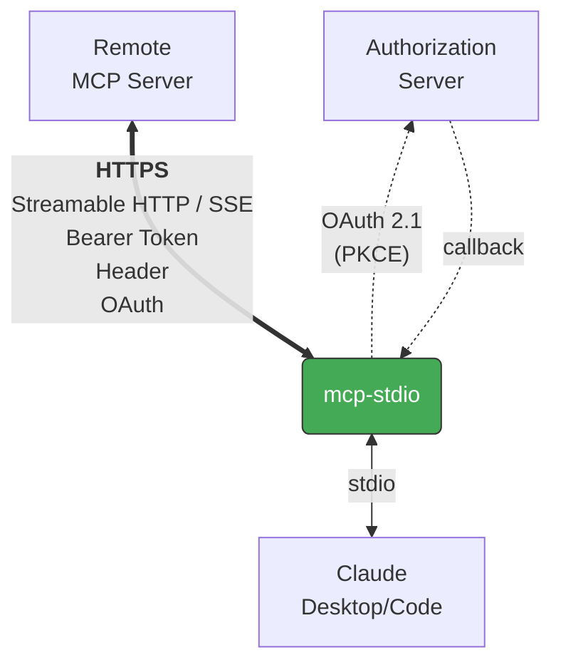

<!-- mcp-name: io.github.shigechika/mcp-stdio -->

# mcp-stdio

English | [日本語](README.ja.md)

Stdio-to-HTTP gateway — connects MCP clients to remote HTTP MCP servers.

## Overview

[MCP](https://modelcontextprotocol.io/) clients like Claude Desktop and Claude Code see mcp-stdio as a locally running self-hosted MCP server, while it relays all requests to a remote MCP server with support for various authentication methods:



Bearer tokens, custom headers, and OAuth 2.1 credentials are forwarded to the remote server.

## Features

- **Both MCP transports supported** — Streamable HTTP (current spec, default) and SSE (MCP 2024-11-05 legacy), selectable with `--transport`. SSE parser follows the [WHATWG Server-Sent Events spec](https://html.spec.whatwg.org/multipage/server-sent-events.html).
- **OAuth 2.1 client** — built-in authorization code flow with PKCE, dynamic client registration, token refresh, and secure token persistence. Implements the full MCP authorization spec at the section level:
  - [RFC 9728](https://www.rfc-editor.org/rfc/rfc9728) Protected Resource Metadata
    - §3 discovery of authorization servers via `/.well-known/oauth-protected-resource`
    - §3.1 path-aware well-known URL construction for path-based reverse-proxy deployments, with host-root fallback; preserves the resource URL's query component on the constructed metadata URL
    - §3.3 `resource` field validation — warn on mismatch, continue
  - [RFC 8414](https://www.rfc-editor.org/rfc/rfc8414) Authorization Server Metadata
    - §3 well-known URL construction, including path insertion for issuers with path components
    - §3 `issuer` validation — warn on mismatch, continue
  - [RFC 8707](https://www.rfc-editor.org/rfc/rfc8707) Resource Indicators
    - §2 `resource` parameter in authorization, token exchange, **and refresh** requests
  - [RFC 7636](https://www.rfc-editor.org/rfc/rfc7636) PKCE
    - §4.1–4.2 S256 `code_challenge_method` with a 96-char `code_verifier`
  - [RFC 7591](https://www.rfc-editor.org/rfc/rfc7591) Dynamic Client Registration
    - §3 client registration request (public client with `token_endpoint_auth_method: none`)
    - §3.2.1 `client_secret_expires_at` handling — auto re-register on expiry
  - [RFC 6750](https://www.rfc-editor.org/rfc/rfc6750) Bearer Token usage
    - §2.1 `Authorization: Bearer <token>` request header
- **Retry with backoff** — retries up to 3 times on connection errors
- **Streaming resilience** — streams SSE responses in real time; auto-reconnects on mid-stream disconnect
- **Session recovery** — resets MCP session ID on 404 and retries
- **Token refresh on 401** — automatically refreshes expired OAuth tokens mid-session
- **Bearer token auth** — via `--bearer-token` flag or `MCP_BEARER_TOKEN` env var
- **Custom headers** — pass any header with `-H` / `--header`
- **Graceful shutdown** — handles SIGTERM/SIGINT
- **Proxy support** — respects `HTTP_PROXY`, `HTTPS_PROXY`, `NO_PROXY` env vars via [httpx](https://www.python-httpx.org/)
- **Minimal dependencies** — only [httpx](https://www.python-httpx.org/); OAuth uses stdlib only

## Install

```bash
pip install mcp-stdio
```

Or with [uv](https://docs.astral.sh/uv/):

```bash
uv tool install mcp-stdio
```

Or run directly without installing:

```bash
uvx mcp-stdio https://your-server.example.com:8080/mcp
```

Or with [Homebrew](https://brew.sh/):

```bash
brew install shigechika/tap/mcp-stdio
```

## Quick Start

```bash
mcp-stdio https://your-server.example.com:8080/mcp
```

With Bearer token authentication:

```bash
# Recommended: use env var (token is hidden from `ps`)
MCP_BEARER_TOKEN=YOUR_TOKEN mcp-stdio https://your-server.example.com:8080/mcp

# Or pass directly (token is visible in `ps` output)
mcp-stdio https://your-server.example.com:8080/mcp --bearer-token YOUR_TOKEN
```

With custom headers:

```bash
mcp-stdio https://your-server.example.com:8080/mcp --header "X-API-Key: YOUR_KEY"
```

With OAuth 2.1 authentication (for servers that require it):

```bash
mcp-stdio --oauth https://your-server.example.com:8080/mcp

# With a pre-registered client ID (skips dynamic registration)
mcp-stdio --oauth --client-id YOUR_CLIENT_ID https://your-server.example.com:8080/mcp
```

For legacy MCP servers using the 2024-11-05 SSE transport:

```bash
mcp-stdio --transport sse https://your-server.example.com:8080/sse
```

Check connectivity before use:

```bash
mcp-stdio --check https://your-server.example.com:8080/mcp
```

## Claude Desktop Configuration

Add to `claude_desktop_config.json`:

```json
{
  "mcpServers": {
    "my-remote-server": {
      "command": "mcp-stdio",
      "args": ["https://your-server.example.com:8080/mcp"],
      "env": {
        "MCP_BEARER_TOKEN": "YOUR_TOKEN"
      }
    }
  }
}
```

Config file locations:
- macOS: `~/Library/Application Support/Claude/claude_desktop_config.json`
- Windows: `%APPDATA%\Claude\claude_desktop_config.json`
- Linux: `~/.config/Claude/claude_desktop_config.json`

## Claude Code Configuration

```bash
claude mcp add my-remote-server \
  -e MCP_BEARER_TOKEN=YOUR_TOKEN \
  -- mcp-stdio https://your-server.example.com:8080/mcp
```

## Usage

```
mcp-stdio [OPTIONS] URL

Arguments:
  URL                    Remote MCP server URL

Options:
  --bearer-token TOKEN   Bearer token (or set MCP_BEARER_TOKEN env var)
  --oauth                Enable OAuth 2.1 authentication
  --client-id ID         Pre-registered OAuth client ID (or set MCP_OAUTH_CLIENT_ID)
  --oauth-scope SCOPE    OAuth scope to request
  -H, --header 'Key: Value'  Custom header (can be repeated)
  --transport {streamable-http,sse}
                         Transport type (default: streamable-http)
  --timeout-connect SEC  Connection timeout (default: 10)
  --timeout-read SEC     Read timeout (default: 120)
  --check                Check connection and exit
  -V, --version          Show version
  -h, --help             Show help
```

## Workarounds

### Claude Code

Works around known issues in Claude Code's HTTP transport:

- **Bearer token not sent** — Claude Code ignores `Authorization` header on tool calls ([#28293](https://github.com/anthropics/claude-code/issues/28293), [#33817](https://github.com/anthropics/claude-code/issues/33817))
- **Missing Accept header** — servers return 406, misinterpreted as auth failure ([#42470](https://github.com/anthropics/claude-code/issues/42470))
- **OAuth fallback loop** — Claude Code enters OAuth discovery even when not needed ([#34008](https://github.com/anthropics/claude-code/issues/34008), [#39271](https://github.com/anthropics/claude-code/issues/39271))
- **Session lost after disconnect** — mcp-stdio recovers MCP sessions automatically on 404 ([#34498](https://github.com/anthropics/claude-code/issues/34498), [#38631](https://github.com/anthropics/claude-code/issues/38631))
- **OAuth scope omitted** — Claude Code sends no `scope` parameter in authorization requests, causing strict OAuth servers to reject the flow ([#4540](https://github.com/anthropics/claude-code/issues/4540)); mcp-stdio sends scopes via `--oauth-scope`
- **Proxy settings ignored** — Claude Code does not respect `NO_PROXY` ([#34804](https://github.com/anthropics/claude-code/issues/34804)); mcp-stdio inherits proxy settings from httpx
- **`prompt=consent` forced on every authorize request** — Claude Code v2.1.109 hardcodes `prompt=consent` on the OAuth authorize URL, which blocks sign-in on Microsoft Entra ID tenants that disable user consent (a common enterprise policy) even when admin consent has already been granted tenant-wide ([#49722](https://github.com/anthropics/claude-code/issues/49722)); mcp-stdio omits `prompt=` from the authorize request, letting the authorization server decide whether the consent UI is needed based on the existing consent state
- **`tools/list` pagination ignored** — Claude Code sends only the first `tools/list` request and silently discards `nextCursor`, so tools beyond page 1 are invisible (breaks MCP gateways and large tool catalogs) ([#39586](https://github.com/anthropics/claude-code/issues/39586)); mcp-stdio follows `nextCursor` transparently across `tools/list`, `resources/list`, `resources/templates/list`, and `prompts/list`, returning a single merged response
- **403 `insufficient_scope` step-up never runs** — when an MCP server requires broader scopes for a specific tool and returns 403 with a `WWW-Authenticate: Bearer error="insufficient_scope", scope="..."` challenge, Claude Code only re-fetches Protected Resource Metadata and never requests a new token, so tiered-scope servers are unusable ([#44652](https://github.com/anthropics/claude-code/issues/44652)); mcp-stdio parses the challenge, runs an RFC 9470 step-up authorization with the union of cached and challenge scopes (reusing the cached client — no DCR retry), and retries the original call
- **OAuth discovery silently fails when `/.well-known/oauth-authorization-server` returns 404** — Claude Code does not fall back to default endpoint paths when the authorization server publishes Protected Resource Metadata but no Authorization Server Metadata, leaving the OAuth flow dead with no browser prompt (e.g. Snowflake Cortex MCP) ([#31349](https://github.com/anthropics/claude-code/issues/31349)); mcp-stdio first tries the RFC 8414 §3 path-inserted URL, then the host-root, and finally falls back to default paths (`/authorize`, `/token`, `/register`) so the flow proceeds without manual endpoint configuration
- **Late response to a cancelled tool call drops the stdio transport** — when Claude Code cancels a request via `notifications/cancelled`, any late JSON-RPC response the server still sends for that id is treated as a framing error, the stdio transport is dropped, and the MCP server reconnects — each cycle costs 5–10 s and heavy cancel usage can put the server in a near-permanent reconnect loop. The MCP spec requires the canceller to silently ignore such responses ([#51073](https://github.com/anthropics/claude-code/issues/51073)); mcp-stdio tracks cancelled ids seen on stdin and drops any matching response on the wire before it reaches the downstream client, which also compensates for servers that violate the reciprocal receiver-side SHOULD ([python-sdk#2480](https://github.com/modelcontextprotocol/python-sdk/issues/2480)). Disable with `--no-cancel-filter` only for debugging raw upstream traffic.
- **Tool discovery blocked by 405 on GET health check** — Claude Code treats a GET `Method Not Allowed` from an HTTP MCP server as a hard failure at session startup and silently skips tool loading even when the subsequent POST `initialize` succeeds, breaking spec-compliant stateless servers like Datadog MCP (the MCP Streamable HTTP spec *requires* 405 on GET when no SSE stream is offered) ([#51721](https://github.com/anthropics/claude-code/issues/51721); the mirror server-side fix to stop serving an idle GET stream under `stateless_http=True` is tracked in [python-sdk#2474](https://github.com/modelcontextprotocol/python-sdk/issues/2474)). Claude Code sees mcp-stdio as a stdio MCP server, so the GET health-check path is never exercised — the POST-only relay is structurally immune to this failure mode.

### mcp-remote

- **OAuth discovery fails for auth server with path** — mcp-remote does not implement the RFC 8414 §3 path insertion rule, causing OAuth metadata discovery to fail when the authorization server URL contains a path component (e.g. multi-tenant or realm-based servers) ([mcp-remote#207](https://github.com/geelen/mcp-remote/issues/207)); mcp-stdio constructs the correct well-known metadata URL.
- **OAuth discovery fails for MCP server behind path-based reverse proxy** — when an MCP server is mounted under a sub-path (e.g. Tailscale serve, nginx `location /mcp/`), Protected Resource Metadata must be fetched at `/.well-known/oauth-protected-resource/{path}` per RFC 9728 §3.1, not at the host root ([mcp-remote#249](https://github.com/geelen/mcp-remote/issues/249)); mcp-stdio tries the path-aware URL first and falls back to host-root for compatibility.
- **Re-authentication loop when both tokens are rejected** — after long inactivity or server-side token revocation, mcp-remote receives the authorization code at the localhost callback but does not exchange it for new tokens, leaving the client looping on the login screen ([mcp-remote#256](https://github.com/geelen/mcp-remote/issues/256)); mcp-stdio clears the stale cache after a failed refresh and drives the full authorization flow through code exchange.
- **SSE stream hangs forever on half-open TCP** — long-running MCP tool calls over SSE can end up on a TCP connection that a proxy, NAT, or firewall silently drops; mcp-remote then blocks `iter_lines()` / `reader.read()` indefinitely because the transport has no idle timeout and no socket keepalive ([mcp-remote#107](https://github.com/geelen/mcp-remote/issues/107), [mcp-remote#226](https://github.com/geelen/mcp-remote/issues/226), [typescript-sdk#1883](https://github.com/modelcontextprotocol/typescript-sdk/issues/1883), [python-sdk#796](https://github.com/modelcontextprotocol/python-sdk/issues/796)). mcp-stdio applies two layers: a 300-second application-level read timeout (`--sse-read-timeout`, matches the Python SDK default) that triggers the existing reconnect loop, and TCP keepalive on the httpx transport (60s idle + 4×15s probes ≈ 120s half-open detection on Linux / macOS / FreeBSD / NetBSD; `SO_KEEPALIVE` alone on Windows). Disable either with `--sse-read-timeout 0` or `--no-tcp-keepalive`.
- **Stale callback server causes EADDRINUSE on reconnect** — mcp-remote caches the local OAuth callback port in a lockfile and crashes on the next invocation when a prior instance's listener is still bound ([mcp-remote#253](https://github.com/geelen/mcp-remote/issues/253)); mcp-stdio binds an ephemeral port via `("127.0.0.1", 0)` for each authorization flow and releases it with `server_close()` before returning — no lockfile, no stale bind, EADDRINUSE is structurally impossible.
- **Duplicate processes corrupt PKCE `code_verifier`** — when Claude Desktop spawns two concurrent mcp-remote processes for the same MCP server, both race through DCR + PKCE and overwrite each other's `code_verifier` on disk, causing `Invalid code_verifier` on token exchange ([mcp-remote#251](https://github.com/geelen/mcp-remote/issues/251)); mcp-stdio keeps the PKCE `code_verifier` as an in-memory local of the authorization function and never writes it to disk, so concurrent flows cannot corrupt each other's state.
- **HTTP 429 rate limiting not honoured** — the MCP TypeScript SDK's `StreamableHTTPClientTransport` (which mcp-remote uses) does not read `Retry-After` on a 429 response; it surfaces a generic error, so any client without its own retry logic fails fast on any rate-limited server ([typescript-sdk#1892](https://github.com/modelcontextprotocol/typescript-sdk/issues/1892)). mcp-stdio parses `Retry-After` (RFC 7231 §7.1.3 — delta-seconds or HTTP-date), sleeps for that long up to a 60-second cap, and retries the request up to `MAX_RETRIES` times; a missing header falls back to the same exponential backoff used for transient errors, and an over-cap wait surfaces the 429 to the client so it can decide whether to retry later.

### Windows

- **CRLF translation on stdio** — Python's default `TextIOWrapper` rewrites `\n` to `\r\n` on Windows, corrupting the NDJSON wire format used by MCP. mcp-stdio reconfigures `sys.stdin`/`sys.stdout` to bare LF mode so messages stay spec-compliant regardless of host OS (cf. [modelcontextprotocol/python-sdk#2433](https://github.com/modelcontextprotocol/python-sdk/issues/2433) for the same class of bug in `stdio_server`).

## How It Works

1. If `--oauth` is set, obtains an access token (cached → refresh → browser flow)
2. Reads JSON-RPC messages from stdin (sent by Claude Desktop/Code)
3. Relays them over HTTPS to the remote MCP server
4. Parses responses and writes them to stdout
5. On 401, refreshes the OAuth token and retries

Transport details:

- **Streamable HTTP** (default) — each stdin message is a single POST; session state is tracked via the `Mcp-Session-Id` header and re-initialized automatically on 404.
- **SSE** (MCP 2024-11-05 legacy) — a persistent `GET` stream delivers responses and the initial `endpoint` event containing the POST URL; the stream auto-reconnects on disconnect.

OAuth tokens are stored in `~/.config/mcp-stdio/tokens.json` (permissions 0600).

## License

MIT
