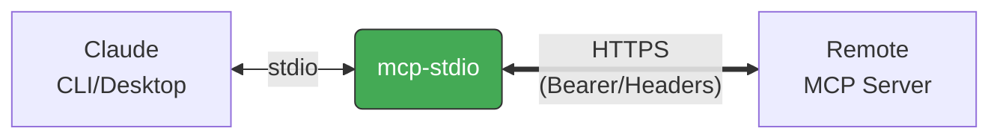

<!-- mcp-name: io.github.shigechika/mcp-stdio -->

# mcp-stdio

English | [日本語](README.ja.md)

Stdio-to-HTTP relay for MCP servers — bridges Claude Desktop/Code to remote Streamable HTTP endpoints.

## Why?

[MCP](https://modelcontextprotocol.io/) clients like Claude Desktop and Claude Code see mcp-stdio as a locally running self-hosted MCP server, while it relays all requests to a remote MCP server over Streamable HTTP:



Bearer tokens and custom headers are forwarded to the remote server.

## Install

```bash
pip install mcp-stdio
```

Or with [uv](https://docs.astral.sh/uv/):

```bash
uv tool install mcp-stdio
```

Or run directly without installing:

```bash
uvx mcp-stdio https://your-server.example.com:8080/mcp
```

Or with [Homebrew](https://brew.sh/):

```bash
brew install shigechika/tap/mcp-stdio
```

## Quick Start

```bash
mcp-stdio https://your-server.example.com:8080/mcp
```

With Bearer token authentication:

```bash
# Recommended: use env var (token is hidden from `ps`)
MCP_BEARER_TOKEN=YOUR_TOKEN mcp-stdio https://your-server.example.com:8080/mcp

# Or pass directly (token is visible in `ps` output)
mcp-stdio https://your-server.example.com:8080/mcp --bearer-token YOUR_TOKEN
```

With custom headers:

```bash
mcp-stdio https://your-server.example.com:8080/mcp -H "X-API-Key: YOUR_KEY"
```

## Claude Desktop Configuration

Add to `claude_desktop_config.json`:

```json
{
  "mcpServers": {
    "my-remote-server": {
      "command": "mcp-stdio",
      "args": ["https://your-server.example.com:8080/mcp"],
      "env": {
        "MCP_BEARER_TOKEN": "YOUR_TOKEN"
      }
    }
  }
}
```

Config file locations:
- macOS: `~/Library/Application Support/Claude/claude_desktop_config.json`
- Windows: `%APPDATA%\Claude\claude_desktop_config.json`
- Linux: `~/.config/Claude/claude_desktop_config.json`

## Claude Code Configuration

```bash
claude mcp add my-remote-server \
  -e MCP_BEARER_TOKEN=YOUR_TOKEN \
  -- mcp-stdio https://your-server.example.com:8080/mcp
```

## Usage

```
mcp-stdio [OPTIONS] URL

Arguments:
  URL                    Remote MCP server URL

Options:
  --bearer-token TOKEN   Bearer token (or set MCP_BEARER_TOKEN env var)
  -H 'Key: Value'        Custom header (can be repeated)
  --timeout-connect SEC  Connection timeout (default: 10)
  --timeout-read SEC     Read timeout (default: 120)
  -V, --version          Show version
  -h, --help             Show help
```

## Use Cases

Works around known issues in Claude Code's HTTP transport:

- **Bearer token not sent** — Claude Code ignores `Authorization` header on tool calls ([#28293](https://github.com/anthropics/claude-code/issues/28293), [#33817](https://github.com/anthropics/claude-code/issues/33817))
- **Missing Accept header** — servers return 406, misinterpreted as auth failure ([#42470](https://github.com/anthropics/claude-code/issues/42470))
- **OAuth fallback loop** — Claude Code enters OAuth discovery even when not needed ([#34008](https://github.com/anthropics/claude-code/issues/34008), [#39271](https://github.com/anthropics/claude-code/issues/39271))

## Features

- **Retry with backoff** — retries up to 3 times on connection errors
- **Session recovery** — resets MCP session ID on 404 and retries
- **Bearer token auth** — via `--bearer-token` flag or `MCP_BEARER_TOKEN` env var
- **Custom headers** — pass any header with `-H`
- **Graceful shutdown** — handles SIGTERM/SIGINT
- **Minimal dependencies** — only [httpx](https://www.python-httpx.org/)

## How It Works

1. Reads JSON-RPC messages from stdin (sent by Claude Desktop/Code)
2. Forwards each message as HTTP POST to the remote MCP server
3. Parses the response (JSON or SSE) and writes it to stdout
4. Maintains the `Mcp-Session-Id` header across requests

## License

MIT
