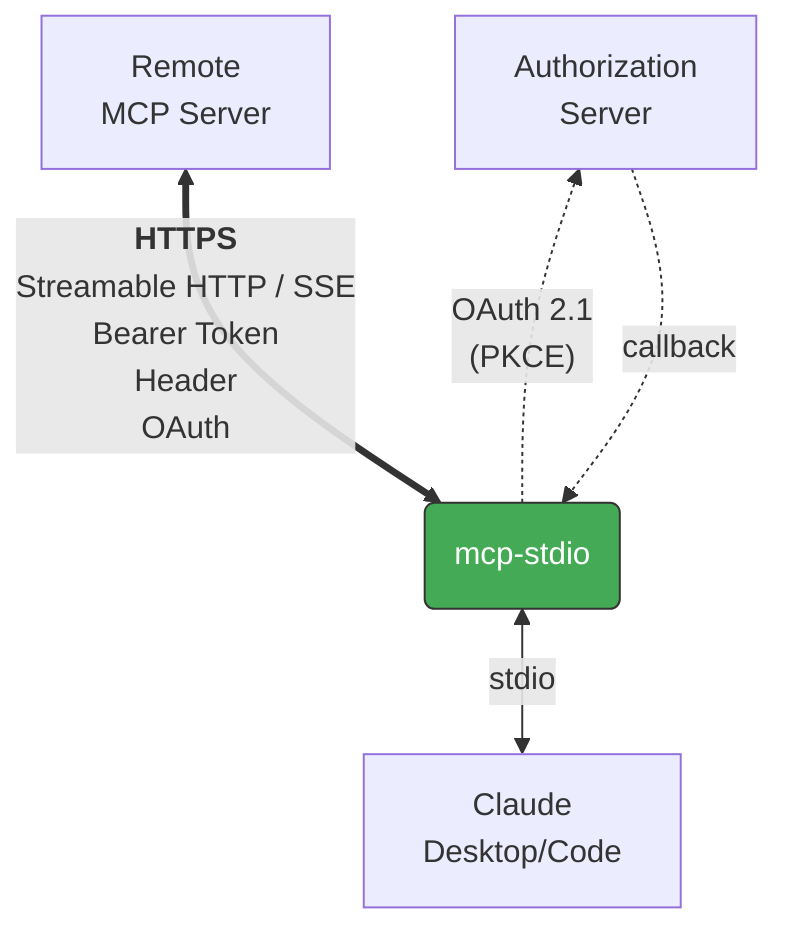

<!-- mcp-name: io.github.shigechika/mcp-stdio -->

# mcp-stdio

English | [日本語](README.ja.md)

Stdio-to-HTTP gateway — connects MCP clients to remote HTTP MCP servers.

## Overview

[MCP](https://modelcontextprotocol.io/) clients like Claude Desktop and Claude Code see mcp-stdio as a locally running self-hosted MCP server, while it relays all requests to a remote MCP server with support for various authentication methods:



Bearer tokens, custom headers, and OAuth 2.1 credentials are forwarded to the remote server.

## Features

- **Both MCP transports supported** — Streamable HTTP (current spec, default) and SSE (MCP 2024-11-05 legacy), selectable with `--transport`. SSE parser follows the [WHATWG Server-Sent Events spec](https://html.spec.whatwg.org/multipage/server-sent-events.html).
- **OAuth 2.1 client** — built-in authorization code flow with PKCE, dynamic client registration, token refresh, and secure token persistence. Implements the full MCP authorization spec:
  - [RFC 9728](https://www.rfc-editor.org/rfc/rfc9728) Protected Resource Metadata discovery
  - [RFC 8414](https://www.rfc-editor.org/rfc/rfc8414) Authorization Server Metadata discovery
  - [RFC 8707](https://www.rfc-editor.org/rfc/rfc8707) Resource Indicators for audience binding
  - [RFC 7636](https://www.rfc-editor.org/rfc/rfc7636) PKCE with S256 challenge method
  - [RFC 7591](https://www.rfc-editor.org/rfc/rfc7591) Dynamic Client Registration
  - [RFC 6750](https://www.rfc-editor.org/rfc/rfc6750) Bearer Token usage
- **Retry with backoff** — retries up to 3 times on connection errors
- **Streaming resilience** — streams SSE responses in real time; auto-reconnects on mid-stream disconnect
- **Session recovery** — resets MCP session ID on 404 and retries
- **Token refresh on 401** — automatically refreshes expired OAuth tokens mid-session
- **Bearer token auth** — via `--bearer-token` flag or `MCP_BEARER_TOKEN` env var
- **Custom headers** — pass any header with `-H`
- **Graceful shutdown** — handles SIGTERM/SIGINT
- **Proxy support** — respects `HTTP_PROXY`, `HTTPS_PROXY`, `NO_PROXY` env vars via [httpx](https://www.python-httpx.org/)
- **Minimal dependencies** — only [httpx](https://www.python-httpx.org/); OAuth uses stdlib only

## Install

```bash
pip install mcp-stdio
```

Or with [uv](https://docs.astral.sh/uv/):

```bash
uv tool install mcp-stdio
```

Or run directly without installing:

```bash
uvx mcp-stdio https://your-server.example.com:8080/mcp
```

Or with [Homebrew](https://brew.sh/):

```bash
brew install shigechika/tap/mcp-stdio
```

## Quick Start

```bash
mcp-stdio https://your-server.example.com:8080/mcp
```

With Bearer token authentication:

```bash
# Recommended: use env var (token is hidden from `ps`)
MCP_BEARER_TOKEN=YOUR_TOKEN mcp-stdio https://your-server.example.com:8080/mcp

# Or pass directly (token is visible in `ps` output)
mcp-stdio https://your-server.example.com:8080/mcp --bearer-token YOUR_TOKEN
```

With custom headers:

```bash
mcp-stdio https://your-server.example.com:8080/mcp --header "X-API-Key: YOUR_KEY"
```

With OAuth 2.1 authentication (for servers that require it):

```bash
mcp-stdio --oauth https://your-server.example.com:8080/mcp

# With a pre-registered client ID (skips dynamic registration)
mcp-stdio --oauth --client-id YOUR_CLIENT_ID https://your-server.example.com:8080/mcp
```

For legacy MCP servers using the 2024-11-05 SSE transport:

```bash
mcp-stdio --transport sse https://your-server.example.com:8080/sse
```

Test connectivity before use:

```bash
mcp-stdio --test https://your-server.example.com:8080/mcp
```

## Claude Desktop Configuration

Add to `claude_desktop_config.json`:

```json
{
  "mcpServers": {
    "my-remote-server": {
      "command": "mcp-stdio",
      "args": ["https://your-server.example.com:8080/mcp"],
      "env": {
        "MCP_BEARER_TOKEN": "YOUR_TOKEN"
      }
    }
  }
}
```

Config file locations:
- macOS: `~/Library/Application Support/Claude/claude_desktop_config.json`
- Windows: `%APPDATA%\Claude\claude_desktop_config.json`
- Linux: `~/.config/Claude/claude_desktop_config.json`

## Claude Code Configuration

```bash
claude mcp add my-remote-server \
  -e MCP_BEARER_TOKEN=YOUR_TOKEN \
  -- mcp-stdio https://your-server.example.com:8080/mcp
```

## Usage

```
mcp-stdio [OPTIONS] URL

Arguments:
  URL                    Remote MCP server URL

Options:
  --bearer-token TOKEN   Bearer token (or set MCP_BEARER_TOKEN env var)
  --oauth                Enable OAuth 2.1 authentication
  --client-id ID         Pre-registered OAuth client ID (or set MCP_OAUTH_CLIENT_ID)
  --oauth-scope SCOPE    OAuth scope to request
  -H, --header 'Key: Value'  Custom header (can be repeated)
  --transport {streamable-http,sse}
                         Transport type (default: streamable-http)
  --timeout-connect SEC  Connection timeout (default: 10)
  --timeout-read SEC     Read timeout (default: 120)
  --test                 Test connection and exit
  -V, --version          Show version
  -h, --help             Show help
```

## Workarounds

Works around known issues in Claude Code's HTTP transport:

- **Bearer token not sent** — Claude Code ignores `Authorization` header on tool calls ([#28293](https://github.com/anthropics/claude-code/issues/28293), [#33817](https://github.com/anthropics/claude-code/issues/33817))
- **Missing Accept header** — servers return 406, misinterpreted as auth failure ([#42470](https://github.com/anthropics/claude-code/issues/42470))
- **OAuth fallback loop** — Claude Code enters OAuth discovery even when not needed ([#34008](https://github.com/anthropics/claude-code/issues/34008), [#39271](https://github.com/anthropics/claude-code/issues/39271))
- **Session lost after disconnect** — mcp-stdio recovers MCP sessions automatically on 404 ([#34498](https://github.com/anthropics/claude-code/issues/34498), [#38631](https://github.com/anthropics/claude-code/issues/38631))
- **OAuth scope omitted** — Claude Code sends no `scope` parameter in authorization requests, causing strict OAuth servers to reject the flow ([#4540](https://github.com/anthropics/claude-code/issues/4540)); mcp-stdio sends scopes via `--oauth-scope`
- **Proxy settings ignored** — Claude Code does not respect `NO_PROXY` ([#34804](https://github.com/anthropics/claude-code/issues/34804)); mcp-stdio inherits proxy settings from httpx

## How It Works

1. If `--oauth` is set, obtains an access token (cached → refresh → browser flow)
2. Reads JSON-RPC messages from stdin (sent by Claude Desktop/Code)
3. Relays them over HTTPS to the remote MCP server
4. Parses responses and writes them to stdout
5. On 401, refreshes the OAuth token and retries

Transport details:

- **Streamable HTTP** (default) — each stdin message is a single POST; session state is tracked via the `Mcp-Session-Id` header and re-initialized automatically on 404.
- **SSE** (MCP 2024-11-05 legacy) — a persistent `GET` stream delivers responses and the initial `endpoint` event containing the POST URL; the stream auto-reconnects on disconnect.

OAuth tokens are stored in `~/.config/mcp-stdio/tokens.json` (permissions 0600).

## License

MIT
