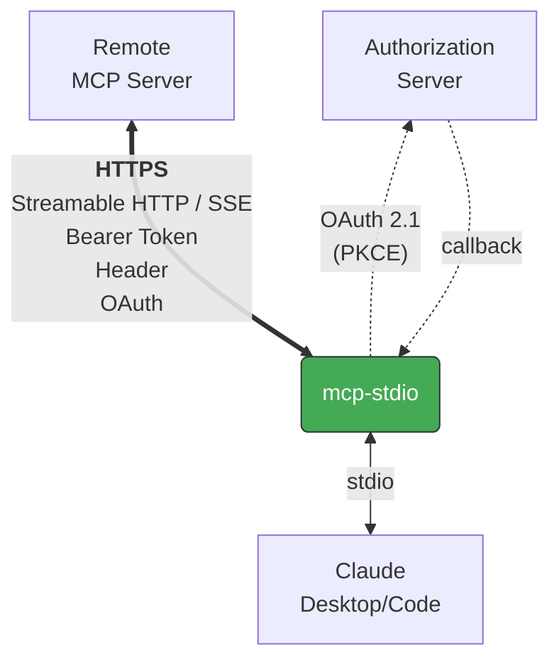
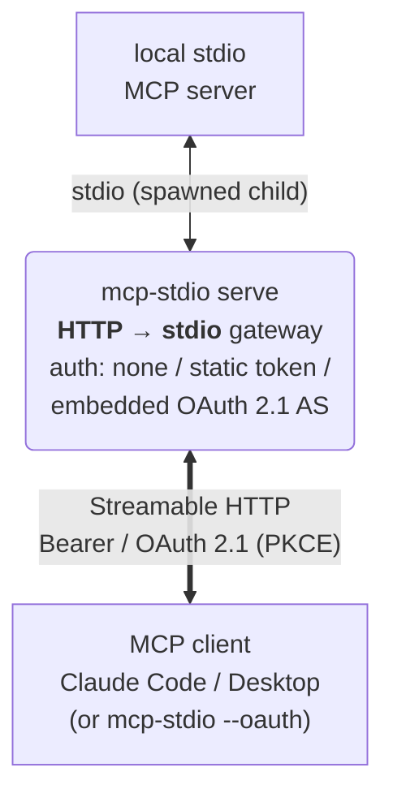

<!-- mcp-name: io.github.shigechika/mcp-stdio -->

# mcp-stdio

English | [日本語](README.ja.md)

Stdio-to-HTTP gateway — connects MCP clients to remote HTTP MCP servers.

## Overview

[MCP](https://modelcontextprotocol.io/) clients like Claude Desktop and Claude Code see mcp-stdio as a locally running self-hosted MCP server, while it relays all requests to a remote MCP server with support for various authentication methods:


```mermaid
flowchart BT
    A[Claude<br>Desktop/Code] <-- stdio --> B(mcp-stdio)
    B <== "<b>HTTPS</b><br>Streamable HTTP / SSE<br>Bearer Token<br>Header<br>OAuth" ==> C[Remote<br>MCP Server]
    B -. "OAuth 2.1<br>(PKCE)" .-> D[Authorization<br>Server]
    D -. callback .-> B
    style B fill:#4a5,stroke:#333,color:#fff
```

Bearer tokens, custom headers, and OAuth 2.1 credentials are forwarded to the remote server.

## Features

- **Both MCP transports supported** — Streamable HTTP (current spec, default) and SSE (MCP 2024-11-05 legacy), selectable with `--transport`. SSE parser follows the [WHATWG Server-Sent Events spec](https://html.spec.whatwg.org/multipage/server-sent-events.html).
- **OAuth 2.1 client** — built-in authorization code flow with PKCE, dynamic client registration, token refresh, and secure token persistence. Implements the full MCP authorization spec at the section level:
  - [RFC 9728](https://www.rfc-editor.org/rfc/rfc9728) Protected Resource Metadata
    - §3 discovery of authorization servers via `/.well-known/oauth-protected-resource`
    - §3.1 path-aware well-known URL construction for path-based reverse-proxy deployments, with host-root fallback; preserves the resource URL's query component on the constructed metadata URL
    - §3.3 `resource` field validation — warn on mismatch, continue
    - §5.1 `WWW-Authenticate: Bearer resource_metadata=` hint — probes the server before discovery so servers that publish PRM at a non-standard URL are found without well-known path guessing
  - [RFC 8414](https://www.rfc-editor.org/rfc/rfc8414) Authorization Server Metadata
    - §3.1 well-known URL construction, including path insertion for issuers with path components
    - §3.3 `issuer` validation — reject a cross-origin issuer (AS mix-up guard), warn on a same-origin mismatch (trailing slash / path / case) and continue
    - §3 OpenID Connect Discovery 1.0 fallback — when the OAuth well-known 404s, probe `/.well-known/openid-configuration` (path-append and path-insertion) for ASes that expose only the OIDC form (Auth0, Okta, Azure AD, Google)
  - [RFC 8707](https://www.rfc-editor.org/rfc/rfc8707) Resource Indicators
    - §2 `resource` parameter in authorization, token exchange, **and refresh** requests
  - [RFC 7636](https://www.rfc-editor.org/rfc/rfc7636) PKCE
    - §4.1–4.2 S256 `code_challenge_method` with an 86-char `code_verifier`
  - [RFC 8628](https://www.rfc-editor.org/rfc/rfc8628) Device Authorization Grant
    - §3.1 device authorization request with `resource` indicator (RFC 8707)
    - §3.4–3.5 token polling with `authorization_pending` / `slow_down` (interval +=5 s) / `expired_token` / `access_denied` handling
    - DCR registers `urn:ietf:params:oauth:grant-type:device_code` in `grant_types` (RFC 7591 §2)
  - [RFC 7591](https://www.rfc-editor.org/rfc/rfc7591) Dynamic Client Registration
    - §3 client registration request; `token_endpoint_auth_method` chosen from `token_endpoint_auth_methods_supported` in AS metadata (prefers `none` → `client_secret_post` → `client_secret_basic`)
    - §3.2.1 `client_secret_expires_at` handling — auto re-register on expiry
    - `application_type: "native"` in DCR ([RFC 8252](https://www.rfc-editor.org/rfc/rfc8252) §8.4 / MCP SEP-837): the loopback auth-code and headless device flows are native clients, so the loopback redirect is not rejected as the RFC 7591 default `"web"`
  - [RFC 6749](https://www.rfc-editor.org/rfc/rfc6749) OAuth 2.0
    - §2.3.1 `client_secret_basic`: `Authorization: Basic` header with percent-encoded credentials (applied to code exchange, token refresh, and Device Authorization Grant polling)
  - [RFC 6750](https://www.rfc-editor.org/rfc/rfc6750) Bearer Token usage
    - §2.1 `Authorization: Bearer <token>` request header
- **Retry with backoff** — retries up to 3 times on connection errors
- **HTTP 429 / 503 handling** — honours `Retry-After` (delta-seconds or HTTP-date) up to a 60-second cap on both 429 (Too Many Requests) and 503 (Service Unavailable) — the two spec-sanctioned Retry-After carriers (RFC 9110 §10.2.3) — then surfaces the status so the client can decide (cf. modelcontextprotocol/typescript-sdk#1892)
- **Auto-pagination** (Streamable HTTP transport) — transparently follows `nextCursor` for `tools/list` / `resources/list` / `resources/templates/list` / `prompts/list` and merges the pages into one response, so clients that drop pages beyond the first still see the full list (cf. anthropics/claude-code#39586)
- **Streaming resilience** — streams SSE responses in real time; auto-reconnects on mid-stream disconnect
- **Line-separator safety** — escapes raw `U+2028` / `U+2029` (legal in JSON, but JavaScript line terminators) in upstream responses so clients that treat them as line breaks cannot mis-frame the output; lossless (cf. modelcontextprotocol/typescript-sdk#2155)
- **Argument normalization** — rewrites a `tools/call` request whose `arguments` is `null` to `{}` so strict servers that reject the null form accept the call; on by default, opt out with `--no-normalize-arguments` (cf. modelcontextprotocol/typescript-sdk#2012)
- **Cancellation-aware filtering** — tracks request ids cancelled via `notifications/cancelled` on stdin and drops any late upstream response carrying one of those ids before it reaches the client, per the MCP cancellation spec; on by default (60 s TTL), opt out with `--no-cancel-filter` (cf. anthropics/claude-code#51073)
- **Session recovery** — resets MCP session ID on 404 and retries
- **Protocol version header** — captures the negotiated `protocolVersion` from the `initialize` response and injects `MCP-Protocol-Version` on every subsequent Streamable HTTP request (MCP spec rev 2025-06-18); servers that enforce the header would otherwise reject post-initialize requests with `400 Bad Request`
- **Token refresh on 401** — automatically refreshes expired OAuth tokens mid-session (OAuth mode only)
- **Proactive token refresh** — a background timer refreshes the OAuth token shortly before it expires (lead time: `--oauth-refresh-leeway`), so a long-lived session survives gateways that signal token expiry as an HTTP 200 tool-error instead of a transport 401 (e.g. Atlassian's MCP gateway); on by default in OAuth mode, opt out with `--no-proactive-refresh` (#242)
- **Step-up authorization on 403** — on a `Bearer error="insufficient_scope"` challenge, re-authorizes for the union of the granted and required scopes ([RFC 9470](https://www.rfc-editor.org/rfc/rfc9470) / MCP step-up; cf. anthropics/claude-code#44652)
- **Cold-start (`--oauth-eager`)** — answers `initialize` locally and runs the interactive OAuth flow on a background thread, so a 30–180 s browser/SSO/MFA login does not exceed the client's ~60 s initialize timeout. Gated methods return `-32002` until login completes, then `notifications/*/list_changed` tells the client to fetch the now-available lists. Streamable HTTP only; a warm (valid/refreshable) cache is unaffected (#296)
- **Bearer token auth** — via `--bearer-token` flag or `MCP_BEARER_TOKEN` env var
- **Custom headers** — pass any header with `-H` / `--header`
- **Graceful shutdown** — handles SIGTERM/SIGINT
- **Proxy support** — respects `HTTP_PROXY`, `HTTPS_PROXY`, `NO_PROXY` env vars via [httpx](https://www.python-httpx.org/)
- **Minimal dependencies** — only [httpx](https://www.python-httpx.org/); OAuth uses stdlib only

## Install

```bash
pip install mcp-stdio
```

Or with [uv](https://docs.astral.sh/uv/):

```bash
uv tool install mcp-stdio
```

Or run directly without installing:

```bash
uvx mcp-stdio https://your-server.example.com:8080/mcp
```

Or with [Homebrew](https://brew.sh/):

```bash
brew install shigechika/tap/mcp-stdio
```

## Quick Start

```bash
mcp-stdio https://your-server.example.com:8080/mcp
```

With Bearer token authentication:

```bash
# Recommended: use env var (token is hidden from `ps`)
MCP_BEARER_TOKEN=YOUR_TOKEN mcp-stdio https://your-server.example.com:8080/mcp

# Or pass directly (token is visible in `ps` output)
mcp-stdio https://your-server.example.com:8080/mcp --bearer-token YOUR_TOKEN
```

With custom headers:

```bash
mcp-stdio https://your-server.example.com:8080/mcp --header "X-API-Key: YOUR_KEY"
```

With OAuth 2.1 authentication (for servers that require it):

```bash
mcp-stdio --oauth https://your-server.example.com:8080/mcp

# With a pre-registered client ID (skips dynamic registration)
mcp-stdio --oauth --client-id YOUR_CLIENT_ID https://your-server.example.com:8080/mcp
```

With OAuth 2.1 Device Authorization Grant (RFC 8628, for headless/SSH environments):

```bash
mcp-stdio --oauth-device https://your-server.example.com:8080/mcp
```

For legacy MCP servers using the 2024-11-05 SSE transport:

```bash
mcp-stdio --transport sse https://your-server.example.com:8080/sse
```

Check connectivity before use:

```bash
mcp-stdio --check https://your-server.example.com:8080/mcp

# For an SSE server, pass --transport sse so --check runs the legacy
# GET/endpoint/POST handshake instead of a Streamable HTTP probe:
mcp-stdio --check --transport sse https://your-server.example.com:8080/sse
```

## Claude Desktop Configuration

Add to `claude_desktop_config.json`:

```json
{
  "mcpServers": {
    "my-remote-server": {
      "command": "mcp-stdio",
      "args": ["https://your-server.example.com:8080/mcp"],
      "env": {
        "MCP_BEARER_TOKEN": "YOUR_TOKEN"
      }
    }
  }
}
```

Config file locations:
- macOS: `~/Library/Application Support/Claude/claude_desktop_config.json`
- Windows: `%APPDATA%\Claude\claude_desktop_config.json`
- Linux: `~/.config/Claude/claude_desktop_config.json`

## Claude Code Configuration

```bash
claude mcp add my-remote-server \
  -e MCP_BEARER_TOKEN=YOUR_TOKEN \
  -- mcp-stdio https://your-server.example.com:8080/mcp
```

## Usage

```
mcp-stdio [OPTIONS] URL

Arguments:
  URL                    Remote MCP server URL

Options:
  --bearer-token TOKEN   Bearer token (or set MCP_BEARER_TOKEN env var)
  --oauth                Enable OAuth 2.1 authentication (browser flow)
  --oauth-device         Enable OAuth 2.1 Device Authorization Grant (RFC 8628, headless)
  --client-id ID         Pre-registered OAuth client ID (or set MCP_OAUTH_CLIENT_ID)
  --oauth-scope SCOPE    OAuth scope to request
  --oauth-use-id-token   Present the OIDC id_token as the Bearer credential
                         instead of the access_token (AWS Bedrock AgentCore /
                         Cognito); falls back to access_token if none is returned (#59)
  --oauth-eager          Cold-start: answer initialize locally and run the
                         interactive OAuth flow in the background, so a long
                         browser/SSO/MFA login does not blow the client's ~60 s
                         initialize timeout. Streamable HTTP only; ignored on
                         --transport sse. Warm cache unaffected (#296)
  --oauth-refresh-leeway SECONDS
                         Proactively refresh tokens this many seconds before
                         expiry (default: 60, or MCP_OAUTH_REFRESH_LEEWAY)
  --no-proactive-refresh
                         Disable the background timer that refreshes the OAuth
                         token before it expires. On by default in OAuth mode;
                         keeps long sessions alive against gateways that signal
                         expiry as an HTTP 200 tool-error rather than a 401 (#242)
  --oauth-timeout SECONDS
                         Seconds to wait for the interactive OAuth flow (browser
                         callback / device-code confirmation) before giving up
                         (default: 120; OAuth only)
  --no-resource-indicator
                         Omit the RFC 8707 resource parameter from all OAuth
                         requests. Required for AS that reject it, such as
                         Microsoft Entra ID v2 with api:// scopes (AADSTS9010010).
                         Persisted in the token store so proactive refreshes
                         and step-up flows stay consistent
  -H, --header 'Key: Value'  Custom header (can be repeated)
  --transport {streamable-http,sse}
                         Transport type (default: streamable-http)
  --timeout-connect SEC  Connection timeout (default: 10)
  --timeout-read SEC     Read timeout (default: 120)
  --sse-read-timeout SEC Idle read timeout on the SSE GET stream
                         (default: 300; 0 disables; SSE transport only)
  --no-tcp-keepalive     Disable TCP keepalive on the HTTP socket
  --no-cancel-filter     Disable the cancel-aware response filter (drops late
                         responses for ids cancelled via notifications/cancelled)
  --no-normalize-arguments
                         Disable rewriting a tools/call request's
                         arguments:null to {} before forwarding
  --check                Check connection and exit
  -V, --version          Show version
  -h, --help             Show help
```

Run `mcp-stdio --help` for the full per-flag detail (platform notes and issue references are more verbose than this table).

## Reverse gateway: `serve` mode

The default mode bridges **stdio → HTTP** (client side). The `serve` subcommand
is the mirror image — **HTTP → stdio** — exposing a local stdio MCP server as a
Streamable HTTP MCP endpoint so clients that cannot spawn it locally can reach
it over the network:


```mermaid
flowchart BT
    A["MCP client<br>Claude Code / Desktop<br>(or mcp-stdio --oauth)"]
    B("mcp-stdio serve<br><b>HTTP → stdio</b> gateway<br>auth: none / static token /<br>embedded OAuth 2.1 AS")
    C["local stdio<br>MCP server"]
    A <== "Streamable HTTP<br>Bearer / OAuth 2.1 (PKCE)" ==> B
    B <-- "stdio (spawned child)" --> C
```

This is the mirror of the client-side diagram at the top: there mcp-stdio is
**stdio → HTTP**; here it is **HTTP → stdio**.

```bash
mcp-stdio serve --port 8080 -- python -m my_mcp_server
```

Then point any MCP client (including mcp-stdio itself) at it:

```bash
mcp-stdio --check http://127.0.0.1:8080/mcp
```

- Stdlib only (`http.server`) — adds no runtime dependency.
- Implements the Streamable HTTP request/response and notification semantics
  plus a GET SSE channel for server-initiated messages.
- **Authentication is optional and layered:**
  - *No token* — the endpoint is open (run it behind a TLS-terminating proxy).
  - *Static token* (`--auth-token` / `MCP_STDIO_SERVE_TOKEN`) — acts as an OAuth
    Resource Server: MCP requests require `Authorization: Bearer <token>`, and a
    401 advertises [RFC 9728](https://www.rfc-editor.org/rfc/rfc9728) Protected
    Resource Metadata at `/.well-known/oauth-protected-resource`.
  - *Embedded OAuth AS* (`--enable-oauth`) — a minimal OAuth 2.1 Authorization
    Server (PKCE auth-code, [RFC 7591](https://www.rfc-editor.org/rfc/rfc7591)
    dynamic client registration with the `invalid_redirect_uri` error per §3.2.2,
    refresh, opaque in-memory tokens, stdlib only). An https issuer echoes the
    [RFC 9207](https://www.rfc-editor.org/rfc/rfc9207) `iss` parameter on the
    authorization response (mix-up defence) and advertises it in metadata.
    The mcp-stdio client's `--oauth` flow then works against the gateway.
- Embedded-AS token security: the Resource Server validates token audience
  ([RFC 8707](https://www.rfc-editor.org/rfc/rfc8707) / MCP — a token issued for
  another resource is rejected); a presented-but-invalid token gets
  `error="invalid_token"` ([RFC 6750](https://www.rfc-editor.org/rfc/rfc6750)
  §3.1); and replaying an authorization code or a rotated refresh token revokes
  the whole grant family ([RFC 6749](https://www.rfc-editor.org/rfc/rfc6749)
  §4.1.2 / [RFC 9700](https://www.rfc-editor.org/rfc/rfc9700) §4.14.2), with a
  brief grace window so a benign client retry is not punished.
- Single-client assumption for now: JSON-RPC ids pass through verbatim.

Static-token example (token via env so it is not visible in `ps`):

```bash
MCP_STDIO_SERVE_TOKEN=your-secret mcp-stdio serve --port 8080 -- python -m my_mcp_server
mcp-stdio --bearer-token your-secret --check http://127.0.0.1:8080/mcp
```

Embedded-OAuth example. User authentication is **delegated to a fronting
reverse proxy** that asserts the logged-in user via a header
(`--trusted-user-header`, only trusted behind a proxy that strips client copies).
`--dev-user` is an **insecure** loopback-only shortcut for local testing:

```bash
mcp-stdio serve --enable-oauth --public-url http://127.0.0.1:8080 \
  --dev-user alice --port 8080 -- python -m my_mcp_server
mcp-stdio --oauth http://127.0.0.1:8080/mcp
```

Options: `--host` (default `127.0.0.1`), `--port` (default `8080`), `--path`
(default `/mcp`), `--auth-token TOKEN` (or `MCP_STDIO_SERVE_TOKEN`, preferred);
and for the embedded AS: `--enable-oauth`, `--public-url URL` (pins the issuer;
recommended behind a proxy), `--trusted-user-header HEADER`, `--dev-user USER`
(insecure, testing only), `--access-token-ttl SECONDS`. In-memory tokens mean a
restart invalidates issued tokens (the client re-runs `--oauth`). The backend
command follows the options (an optional `--` separator is supported).

  - *Path-scoped issuer* — `--public-url` retains a path, so several
    `--enable-oauth` backends can share one host behind a reverse proxy, each
    under its own prefix (e.g. `--public-url https://gw.example.org/team-a`
    serving `https://gw.example.org/team-a/mcp`). The issuer becomes
    `https://gw.example.org/team-a`, its AS endpoints live under the prefix
    (`/team-a/authorize`, `/token`, `/register`), and the well-known documents
    sit at the [RFC 8414](https://www.rfc-editor.org/rfc/rfc8414) §3.1 /
    [RFC 9728](https://www.rfc-editor.org/rfc/rfc9728) §3.1 root-inserted
    locations (`/.well-known/oauth-authorization-server/team-a`,
    `/.well-known/oauth-protected-resource/team-a/mcp`) — byte-symmetric with
    the client's path-aware discovery. A bare-origin `--public-url` behaves
    exactly as before (#245).

## Workarounds

See [WORKAROUNDS.md](WORKAROUNDS.md) for known issues in Claude Code, mcp-remote, the MCP SDKs, and Windows that mcp-stdio addresses.

## How It Works

1. If `--oauth` (browser) or `--oauth-device` (headless, RFC 8628) is set, obtains an access token (cached → refresh → browser/device flow)
2. Reads JSON-RPC messages from stdin (sent by Claude Desktop/Code)
3. Relays them over HTTPS to the remote MCP server
4. Parses responses and writes them to stdout
5. On 401 (OAuth mode only), refreshes the access token and retries; with static `--bearer-token` / `-H` auth the 401 is surfaced to the client
6. In OAuth mode a background timer also refreshes the token shortly before it expires (`--oauth-refresh-leeway`), independent of request flow — this keeps long sessions alive against gateways that report token expiry as an HTTP 200 tool-error rather than a 401 (opt out with `--no-proactive-refresh`)

Transport details:

- **Streamable HTTP** (default) — each stdin message is a single POST; session state is tracked via the `Mcp-Session-Id` header and re-initialized automatically on 404. The negotiated `MCP-Protocol-Version` header is sent on every post-initialize request (spec rev 2025-06-18).
- **SSE** (MCP 2024-11-05 legacy) — a persistent `GET` stream delivers responses and the initial `endpoint` event containing the POST URL; the stream auto-reconnects on disconnect.

OAuth tokens are stored in `~/.config/mcp-stdio/tokens.json` (permissions 0600).

## License

MIT
