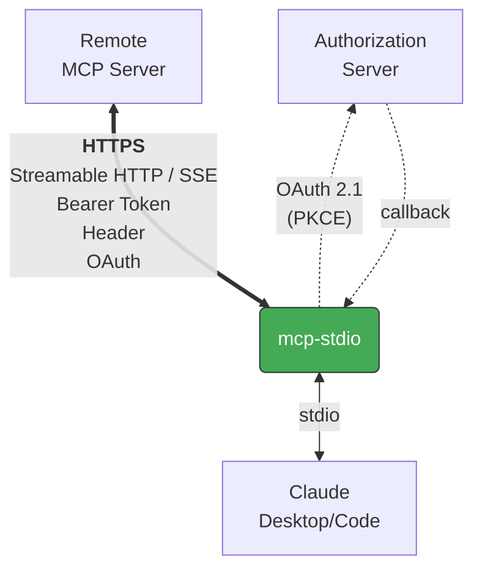

<!-- mcp-name: io.github.shigechika/mcp-stdio -->

# mcp-stdio

English | [日本語](README.ja.md)

Stdio-to-HTTP gateway — connects MCP clients to remote HTTP MCP servers.

## Overview

[MCP](https://modelcontextprotocol.io/) clients like Claude Desktop and Claude Code see mcp-stdio as a locally running self-hosted MCP server, while it relays all requests to a remote MCP server with support for various authentication methods:


```mermaid
flowchart BT
    A[Claude<br>Desktop/Code] <-- stdio --> B(mcp-stdio)
    B <== "<b>HTTPS</b><br>Streamable HTTP / SSE<br>Bearer Token<br>Header<br>OAuth" ==> C[Remote<br>MCP Server]
    B -. "OAuth 2.1<br>(PKCE)" .-> D[Authorization<br>Server]
    D -. callback .-> B
    style B fill:#4a5,stroke:#333,color:#fff
```

Bearer tokens, custom headers, and OAuth 2.1 credentials are forwarded to the remote server.

## Features

- **Both MCP transports supported** — Streamable HTTP (current spec, default) and SSE (MCP 2024-11-05 legacy), selectable with `--transport`. SSE parser follows the [WHATWG Server-Sent Events spec](https://html.spec.whatwg.org/multipage/server-sent-events.html).
- **OAuth 2.1 client** — built-in authorization code flow with PKCE, dynamic client registration, token refresh, and secure token persistence. Implements the full MCP authorization spec at the section level:
  - [RFC 9728](https://www.rfc-editor.org/rfc/rfc9728) Protected Resource Metadata
    - §3 discovery of authorization servers via `/.well-known/oauth-protected-resource`
    - §3.1 path-aware well-known URL construction for path-based reverse-proxy deployments, with host-root fallback; preserves the resource URL's query component on the constructed metadata URL
    - §3.3 `resource` field validation — warn on mismatch, continue
    - §5.1 `WWW-Authenticate: Bearer resource_metadata=` hint — probes the server before discovery so servers that publish PRM at a non-standard URL are found without well-known path guessing
  - [RFC 8414](https://www.rfc-editor.org/rfc/rfc8414) Authorization Server Metadata
    - §3 well-known URL construction, including path insertion for issuers with path components
    - §3 `issuer` validation — warn on mismatch, continue
  - [RFC 8707](https://www.rfc-editor.org/rfc/rfc8707) Resource Indicators
    - §2 `resource` parameter in authorization, token exchange, **and refresh** requests
  - [RFC 7636](https://www.rfc-editor.org/rfc/rfc7636) PKCE
    - §4.1–4.2 S256 `code_challenge_method` with a 96-char `code_verifier`
  - [RFC 8628](https://www.rfc-editor.org/rfc/rfc8628) Device Authorization Grant
    - §3.1 device authorization request with `resource` indicator (RFC 8707)
    - §3.4–3.5 token polling with `authorization_pending` / `slow_down` (interval +=5 s) / `expired_token` / `access_denied` handling
    - DCR registers `urn:ietf:params:oauth:grant-type:device_code` in `grant_types` (RFC 7591 §2)
  - [RFC 7591](https://www.rfc-editor.org/rfc/rfc7591) Dynamic Client Registration
    - §3 client registration request; `token_endpoint_auth_method` chosen from `token_endpoint_auth_methods_supported` in AS metadata (prefers `none` → `client_secret_post` → `client_secret_basic`)
    - §3.2.1 `client_secret_expires_at` handling — auto re-register on expiry
  - [RFC 6749](https://www.rfc-editor.org/rfc/rfc6749) OAuth 2.0
    - §2.3.1 `client_secret_basic`: `Authorization: Basic` header with percent-encoded credentials (applied to code exchange, token refresh, and Device Authorization Grant polling)
  - [RFC 6750](https://www.rfc-editor.org/rfc/rfc6750) Bearer Token usage
    - §2.1 `Authorization: Bearer <token>` request header
- **Retry with backoff** — retries up to 3 times on connection errors
- **Streaming resilience** — streams SSE responses in real time; auto-reconnects on mid-stream disconnect
- **Session recovery** — resets MCP session ID on 404 and retries
- **Token refresh on 401** — automatically refreshes expired OAuth tokens mid-session
- **Bearer token auth** — via `--bearer-token` flag or `MCP_BEARER_TOKEN` env var
- **Custom headers** — pass any header with `-H` / `--header`
- **Graceful shutdown** — handles SIGTERM/SIGINT
- **Proxy support** — respects `HTTP_PROXY`, `HTTPS_PROXY`, `NO_PROXY` env vars via [httpx](https://www.python-httpx.org/)
- **Minimal dependencies** — only [httpx](https://www.python-httpx.org/); OAuth uses stdlib only

## Install

```bash
pip install mcp-stdio
```

Or with [uv](https://docs.astral.sh/uv/):

```bash
uv tool install mcp-stdio
```

Or run directly without installing:

```bash
uvx mcp-stdio https://your-server.example.com:8080/mcp
```

Or with [Homebrew](https://brew.sh/):

```bash
brew install shigechika/tap/mcp-stdio
```

## Quick Start

```bash
mcp-stdio https://your-server.example.com:8080/mcp
```

With Bearer token authentication:

```bash
# Recommended: use env var (token is hidden from `ps`)
MCP_BEARER_TOKEN=YOUR_TOKEN mcp-stdio https://your-server.example.com:8080/mcp

# Or pass directly (token is visible in `ps` output)
mcp-stdio https://your-server.example.com:8080/mcp --bearer-token YOUR_TOKEN
```

With custom headers:

```bash
mcp-stdio https://your-server.example.com:8080/mcp --header "X-API-Key: YOUR_KEY"
```

With OAuth 2.1 authentication (for servers that require it):

```bash
mcp-stdio --oauth https://your-server.example.com:8080/mcp

# With a pre-registered client ID (skips dynamic registration)
mcp-stdio --oauth --client-id YOUR_CLIENT_ID https://your-server.example.com:8080/mcp
```

With OAuth 2.1 Device Authorization Grant (RFC 8628, for headless/SSH environments):

```bash
mcp-stdio --oauth-device https://your-server.example.com:8080/mcp
```

For legacy MCP servers using the 2024-11-05 SSE transport:

```bash
mcp-stdio --transport sse https://your-server.example.com:8080/sse
```

Check connectivity before use:

```bash
mcp-stdio --check https://your-server.example.com:8080/mcp
```

## Claude Desktop Configuration

Add to `claude_desktop_config.json`:

```json
{
  "mcpServers": {
    "my-remote-server": {
      "command": "mcp-stdio",
      "args": ["https://your-server.example.com:8080/mcp"],
      "env": {
        "MCP_BEARER_TOKEN": "YOUR_TOKEN"
      }
    }
  }
}
```

Config file locations:
- macOS: `~/Library/Application Support/Claude/claude_desktop_config.json`
- Windows: `%APPDATA%\Claude\claude_desktop_config.json`
- Linux: `~/.config/Claude/claude_desktop_config.json`

## Claude Code Configuration

```bash
claude mcp add my-remote-server \
  -e MCP_BEARER_TOKEN=YOUR_TOKEN \
  -- mcp-stdio https://your-server.example.com:8080/mcp
```

## Usage

```
mcp-stdio [OPTIONS] URL

Arguments:
  URL                    Remote MCP server URL

Options:
  --bearer-token TOKEN   Bearer token (or set MCP_BEARER_TOKEN env var)
  --oauth                Enable OAuth 2.1 authentication (browser flow)
  --oauth-device         Enable OAuth 2.1 Device Authorization Grant (RFC 8628, headless)
  --client-id ID         Pre-registered OAuth client ID (or set MCP_OAUTH_CLIENT_ID)
  --oauth-scope SCOPE    OAuth scope to request
  --oauth-refresh-leeway SECONDS
                         Proactively refresh tokens this many seconds before
                         expiry (default: 60, or MCP_OAUTH_REFRESH_LEEWAY)
  -H, --header 'Key: Value'  Custom header (can be repeated)
  --transport {streamable-http,sse}
                         Transport type (default: streamable-http)
  --timeout-connect SEC  Connection timeout (default: 10)
  --timeout-read SEC     Read timeout (default: 120)
  --check                Check connection and exit
  -V, --version          Show version
  -h, --help             Show help
```

## Workarounds

See [WORKAROUNDS.md](WORKAROUNDS.md) for known issues in Claude Code, mcp-remote, and Windows that mcp-stdio addresses.

## How It Works

1. If `--oauth` is set, obtains an access token (cached → refresh → browser flow)
2. Reads JSON-RPC messages from stdin (sent by Claude Desktop/Code)
3. Relays them over HTTPS to the remote MCP server
4. Parses responses and writes them to stdout
5. On 401, refreshes the OAuth token and retries

Transport details:

- **Streamable HTTP** (default) — each stdin message is a single POST; session state is tracked via the `Mcp-Session-Id` header and re-initialized automatically on 404.
- **SSE** (MCP 2024-11-05 legacy) — a persistent `GET` stream delivers responses and the initial `endpoint` event containing the POST URL; the stream auto-reconnects on disconnect.

OAuth tokens are stored in `~/.config/mcp-stdio/tokens.json` (permissions 0600).

## License

MIT
