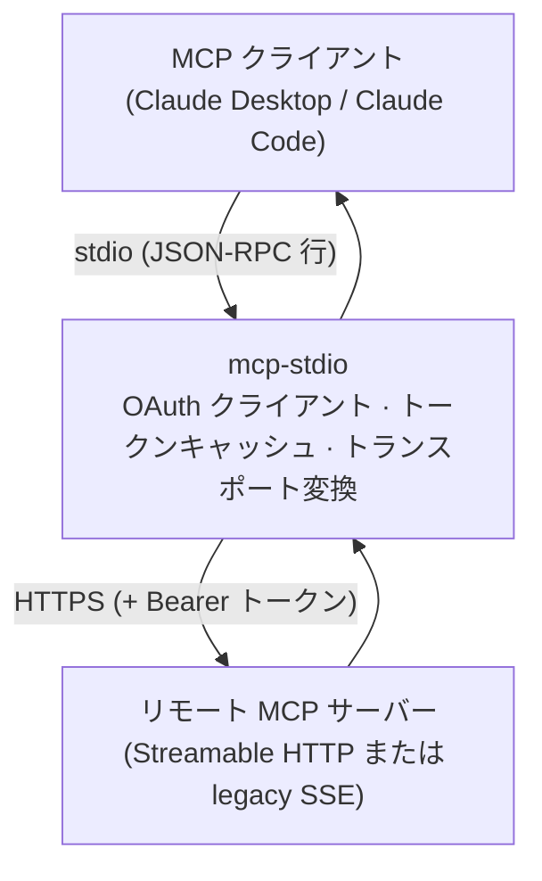
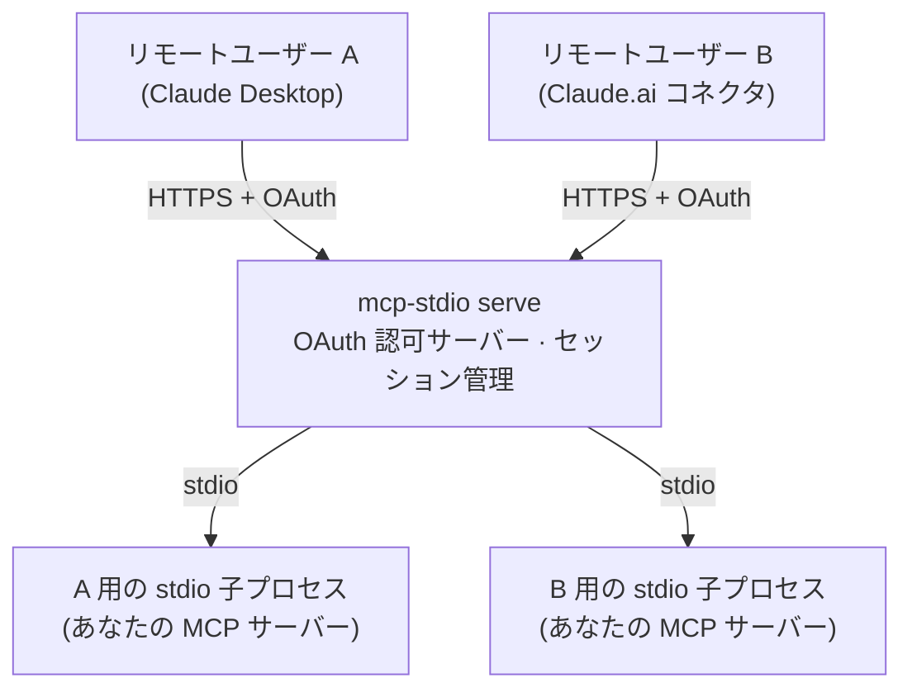
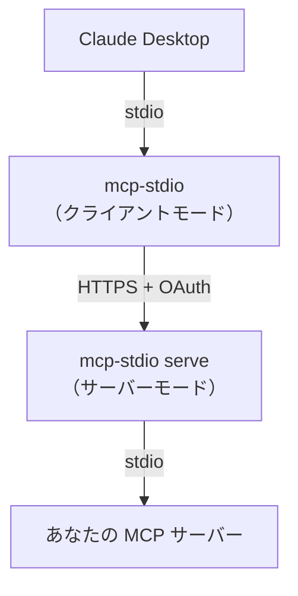

# ふたつの使い方

mcp-stdio はひとつのコマンドにふたつの明確に異なる役割があります。この
ドキュメントの残り全部がこの選択にぶら下がっているので、まずここで
整理してください。

|  | **クライアント側ゲートウェイ**（デフォルト） | **サーバーゲートウェイ**（`serve`） |
|---|---|---|
| あなたは… | 誰かのリモート MCP サーバーを*使う*側 | 自分の MCP サーバーを*公開する*側 |
| MCP サーバーの居場所 | どこか別の場所、HTTPS の向こう | あなたのマシン上、stdio で動作 |
| mcp-stdio の居場所 | MCP クライアントの隣（手元のマシン） | MCP サーバーの隣（公開ホスト） |
| 変換の向き | stdio → Streamable HTTP / SSE | Streamable HTTP → stdio |
| OAuth での役割 | **クライアント**：ログインし、トークンを保存・リフレッシュ | **認可サーバー**：クライアントを登録し、トークンを発行・検証 |
| 典型的な利用者 | Claude Desktop / Claude Code でリモートサーバーを使う人 | stdio MCP サーバーをリモートユーザーに届けたい運用者 |
| 次に読む | [リモート MCP サーバーに接続する](guides/connect-remote.md) | [stdio サーバーを公開する](guides/serve.md) |

## クライアント側ゲートウェイとして（デフォルトモード）

MCP クライアント（Claude Desktop、Claude Code など）はローカルの stdio
プロセスしか起動できませんが、使いたいサーバーはネットワークの向こうに
あります。mcp-stdio がそのローカルプロセス*そのもの*になります：
クライアントは mcp-stdio と stdio で会話し、mcp-stdio がすべての
メッセージを HTTPS でリモートサーバーへ中継します——OAuth ログイン、
トークンキャッシュ、リフレッシュを引き受けるので、接続はアクセス
トークンの寿命より長生きします。



```bash
mcp-stdio --oauth https://mcp.example.com/mcp
```

このモードが欲しくなるのは：

- ベンダーやチームがホストする MCP サーバーを Claude Desktop / Claude
  Code から使いたいとき；
- クライアント単体では完結できない OAuth ログインをサーバーが要求する
  とき；
- クライアントが対応をやめた legacy SSE トランスポートをサーバーが
  まだ話しているとき。

→ **[リモート MCP サーバーに接続する](guides/connect-remote.md)** へ。

## サーバーゲートウェイとして（`serve` モード）

手元のマシンで stdio を話す MCP サーバーを書いた（または動かしている）。
それをリモートユーザーが*彼らの* MCP クライアントから使えるようにしたい。
`mcp-stdio serve` はそれを本物の Streamable HTTP エンドポイントにします：
片側で HTTPS を受け、もう片側では**ユーザーセッションごとに**隔離された
stdio 子プロセスを spawn し、`--enable-oauth` を付ければクライアント登録と
トークン発行を担う OAuth 2.1 認可サーバーとしてすべてを守ります。



```bash
mcp-stdio serve --enable-oauth \
  --public-url https://mcp.example.com \
  --token-store /var/lib/mcp-stdio/state.json \
  -- python -m my_mcp_server
```

このモードが欲しくなるのは：

- MCP サーバーが stdio 専用で、リモートクライアントから届かせたいとき；
- 複数ユーザーがひとつのデプロイを**プロセスを共有せずに**使う必要が
  あるとき——各セッションが専用の子プロセスを持ち、認証済みユーザーに
  束縛されます；
- 前段に本物の OAuth が必要だが、エンドポイントひとつのために Keycloak
  を立てたくはないとき。

→ **[stdio サーバーを公開する](guides/serve.md)** へ。

## 両方いっぺんに

ふたつの役割は組み合わせられます。よくあるパターン：運用者が社内サーバー
を `serve` で公開し、チームの全員が手元のラップトップからクライアント
モードの mcp-stdio で接続する——両端で同じパッケージが、それぞれ OAuth の
自分の側を担当します。


