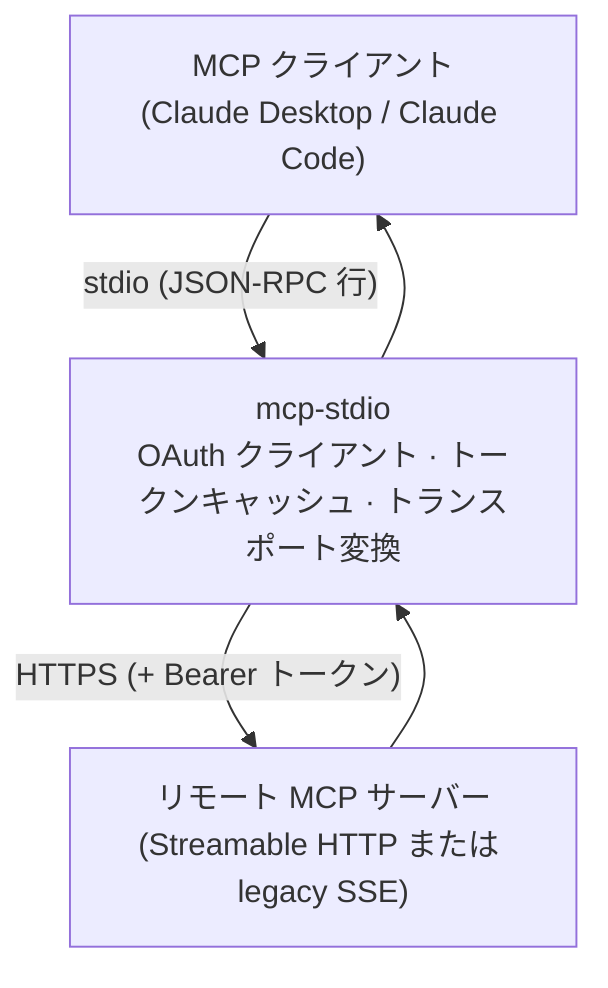
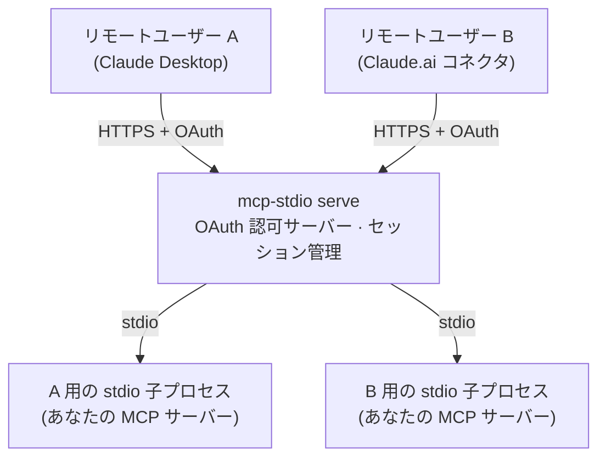
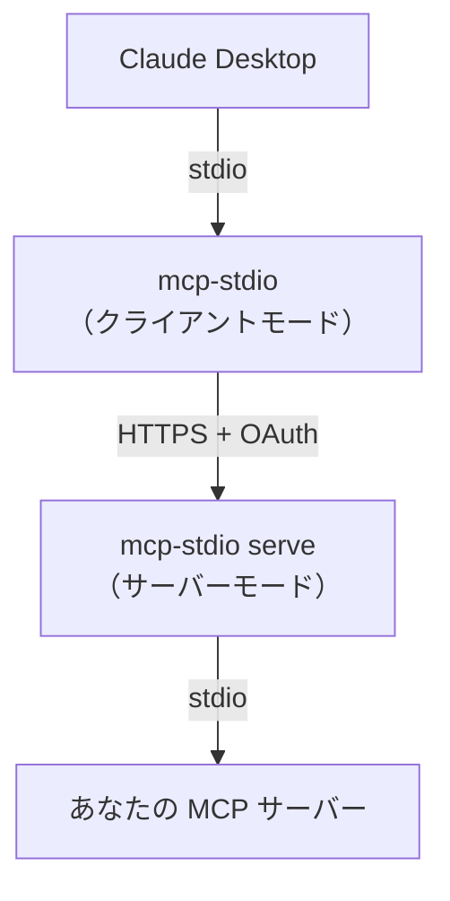

# ふたつの使い方

mcp-stdio はひとつのコマンドにふたつの明確に異なる役割があります。この
ドキュメントの残り全部がこの選択にぶら下がっているので、まずここで
整理してください。

|  | **クライアント側ゲートウェイ**（デフォルト） | **サーバーゲートウェイ**（`serve`） |
|---|---|---|
| あなたは… | 誰かのリモート MCP サーバーを*使う*側 | 自分の MCP サーバーを*公開する*側 |
| MCP サーバーの居場所 | どこか別の場所、HTTPS の向こう | あなたのマシン上、stdio で動作 |
| mcp-stdio の居場所 | MCP クライアントの隣（手元のマシン） | MCP サーバーの隣（公開ホスト） |
| 変換の向き | stdio → Streamable HTTP / SSE | Streamable HTTP → stdio |
| OAuth での役割 | **クライアント**：ログインし、トークンを保存・リフレッシュ | **認可サーバー**：クライアントを登録し、トークンを発行・検証 |
| 典型的な利用者 | Claude Desktop / Claude Code でリモートサーバーを使う人 | stdio MCP サーバーをリモートユーザーに届けたい運用者 |
| 次に読む | [リモート MCP サーバーに接続する](guides/connect-remote.md) | [stdio サーバーを公開する](guides/serve.md) |

## クライアント側ゲートウェイとして（デフォルトモード）

MCP クライアント（Claude Desktop、Claude Code など）はローカルの stdio
プロセスしか起動できませんが、使いたいサーバーはネットワークの向こうに
あります。mcp-stdio がそのローカルプロセス*そのもの*になります：
クライアントは mcp-stdio と stdio で会話し、mcp-stdio がすべての
メッセージを HTTPS でリモートサーバーへ中継します——OAuth ログイン、
トークンキャッシュ、リフレッシュを引き受けるので、接続はアクセス
トークンの寿命より長生きします。



```bash
mcp-stdio --oauth https://mcp.example.com/mcp
```

このモードが欲しくなるのは：

- ベンダーやチームがホストする MCP サーバーを Claude Desktop / Claude
  Code から使いたいとき；
- クライアント単体では完結できない OAuth ログインをサーバーが要求する
  とき；
- クライアントが対応をやめた legacy SSE トランスポートをサーバーが
  まだ話しているとき。

→ **[リモート MCP サーバーに接続する](guides/connect-remote.md)** へ。

## サーバーゲートウェイとして（`serve` モード）

手元のマシンで stdio を話す MCP サーバーを書いた（または動かしている）。
それをリモートユーザーが*彼らの* MCP クライアントから使えるようにしたい。
`mcp-stdio serve` はそれを本物の Streamable HTTP エンドポイントにします：
片側で HTTPS を受け、もう片側では**ユーザーセッションごとに**隔離された
stdio 子プロセスを spawn し、`--enable-oauth` を付ければクライアント登録と
トークン発行を担う OAuth 2.1 認可サーバーとしてすべてを守ります。



```bash
mcp-stdio serve --enable-oauth \
  --public-url https://mcp.example.com \
  --token-store /var/lib/mcp-stdio/state.json \
  -- python -m my_mcp_server
```

このモードが欲しくなるのは：

- MCP サーバーが stdio 専用で、リモートクライアントから届かせたいとき；
- 複数ユーザーがひとつのデプロイを**プロセスを共有せずに**使う必要が
  あるとき——各セッションが専用の子プロセスを持ち、認証済みユーザーに
  束縛されます；
- 前段に本物の OAuth が必要だが、エンドポイントひとつのために Keycloak
  を立てたくはないとき。

→ **[stdio サーバーを公開する](guides/serve.md)** へ。

<a id="protocol-eras"></a>

## プロトコル era（MCP 2026-07-28）

MCP は仕様リビジョン **2026-07-28** で形が変わりました。mcp-stdio は
このふたつの形を *era* と呼び、ゲートウェイの両方の顔がどちらも話せます。

| | **legacy**（2025-06-18 以前） | **modern**（2026-07-28） |
|---|---|---|
| ハンドシェイク | `initialize` + `notifications/initialized` | なし——代わりに `server/discover` を尋ねる |
| 状態 | `Mcp-Session-Id` がリクエスト同士を結びつける | なし。すべてのリクエストが単独で完結する |
| リクエストごとのメタデータ | `initialize` で一度だけネゴシエート | 毎リクエストの body に `_meta`、ヘッダに `Mcp-Method` / `Mcp-Name` |
| サーバー → クライアントのリクエスト | 接続上で直接送られる | multi round-trip requests（MRTR）に置き換え |

### クライアントモード：`--protocol-era`

```bash
mcp-stdio --protocol-era auto https://mcp.example.com/mcp
```

| 値 | 何が起きるか |
|---|---|
| `legacy`（**デフォルト**） | 現行の挙動そのまま、バイト単位で不変。プローブなし、追加リクエストなし |
| `auto` | stdin ループ開始前に `server/discover` を 1 回だけプローブし、その答えが示す era を採用する |
| `modern` | 強制。era の判定はしないが、サーバーのケーパビリティ収集のためプローブ自体は走る |

`legacy` がデフォルトなのは意図的です：mcp-stdio を上げただけで、
既存デプロイのワイヤ上のトラフィックが変わってはいけません。`auto` の
コストは起動時の HTTP リクエスト 1 回ぶんちょうどで、だからこそ
オプトインになっています。

プローブが modern サーバーだと確認できなかった場合、`auto` は `legacy`
にフォールバックし、その旨を stderr に出します
（`protocol era: legacy (auto-detected)`）。

!!! note "SSE transport ではこのフラグは無視される"
    `--protocol-era` は Streamable HTTP 専用です。`--transport sse` の下
    では警告付きで無視されます——そのトランスポート自体が
    Streamable HTTP 以前の legacy なものだからです：

    ```
    warning: --protocol-era auto is ignored on --transport sse
    (always the pre-Streamable-HTTP legacy transport)
    ```

### modern クライアント経路が代わりにやってくれること

MCP クライアントは終始これまでどおり 2025-06-18 の方言を話し続けます——
翻訳は mcp-stdio がやります。modern era では、さらに次のことをします。

- **`initialize` にローカルで答える。** modern サーバーにハンドシェイクは
  存在しないので、relay は `server/discover` が報告した内容から
  `InitializeResult` を合成し、クライアントの `initialize` を上流へ
  転送しません。
- **すべてのリクエストに刻印する。** リビジョンが要求する `_meta` ブロックと
  `Mcp-Method` / `Mcp-Name` ヘッダを付け、`Mcp-Session-Id` は一切
  送りません。
- **`subscriptions/listen` ストリームをバックグラウンドで保持する。**
  サーバー通知がクライアントに届き続けるようにするためです。
  `resources/subscribe` 用には専用の 2 本目のストリームを持ちます——
  modern リビジョンがこれらのメソッドをワイヤから削除したため、
  クライアントの `resources/subscribe` / `resources/unsubscribe` は
  ローカルで応答し、そのストリームのフィルタへ翻訳します。
- **MRTR を bridge する。** サーバーが `tools/call` に「まず入力が要る」と
  答えたとき、relay はその中の各リクエストを、クライアントが既に理解して
  いる `elicitation/create` / `sampling/createMessage` / `roots/list` へ
  戻し、答えを集めて元の呼び出しを再送します——2025 年世代の
  クライアントが、自分より後に設計されたやりとりを透過的に完了できます。
  ケーパビリティの*広告*を止めたい場合は `MCP_STDIO_MRTR_STRIP=1`。
- **キャンセルを本当に効かせる。** このトランスポートではレスポンス
  ストリームを閉じることが*そのまま*キャンセル信号であり、上流に
  `notifications/cancelled` は送りません。クライアントからのキャンセルは、
  遅れて来る応答を抑止するだけでなく、進行中のリクエストを実際に
  中断します。

    キャンセルがリクエストを打ち切れない窓が 3 つだけあります。いずれも
    狭く、どれも退行ではありません（これ以前の modern era はキャンセルを
    まったく尊重しませんでした）：relay がリクエストを取り上げる前に届いた
    キャンセル、レスポンスヘッダを送る*前*にすべての処理を済ませる
    サーバー（閉じるべきストリームがまだ開いていない）、そして
    自動ページネーション中のリクエスト。いずれの場合もキャンセル自体は
    追跡され続けるので、遅延応答はクライアントに届く前に drop されます。

### serve モードは dual-era

`mcp-stdio serve` は同じエンドポイントで呼び出し側の era に合わせて応答し、
あなたの stdio サーバーはそれを知る必要がありません。

- **modern クライアント**には、ゲートウェイが `server/discover` に答えます
  （クライアントの代わりに子プロセスと行ったハンドシェイクの結果から）。
  以降 `tools/list`、`tools/call` などをステートレスに dispatch します——
  セッションは発行されず、呼び出し側が送ってきても echo し返しません。
  結果は送出時に**刻印**され、リビジョンが要求する `resultType` と、
  cacheable な 6 つの操作には `ttlMs` / `cacheScope` のキャッシュヒントが
  付きます（[`--cache-ttl-ms`](reference.md#modern-era-2026-07-28) 参照）。
- **legacy クライアント**は従来どおりの挙動のままです：`initialize` が
  `Mcp-Session-Id` を発行し、セッションごとに子プロセス 1 つ、`GET` で
  SSE ストリーム、`DELETE` で終了。

modern リクエストは、セッションではなく**認証済みプリンシパル**を鍵として
ゲートウェイ所有の子プロセスから提供されます——認証なし／静的トークンなら
共有の子 1 つ、OAuth ユーザーごとなら 1 つずつ。ステートレスな
クライアントには鍵にできるセッションが無いからです。

!!! warning "まだ提供していない：`subscriptions/listen`"
    serve は modern の通知ストリームを実装していないため、
    `subscriptions/listen` リクエストには、黙って受理するのではなく
    `404` と JSON-RPC `-32601`（method not found）を返します。
    [#374](https://github.com/shigechika/mcp-stdio/issues/374) で追跡中。

## 両方いっぺんに

ふたつの役割は組み合わせられます。よくあるパターン：運用者が社内サーバー
を `serve` で公開し、チームの全員が手元のラップトップからクライアント
モードの mcp-stdio で接続する——両端で同じパッケージが、それぞれ OAuth の
自分の側を担当します。


