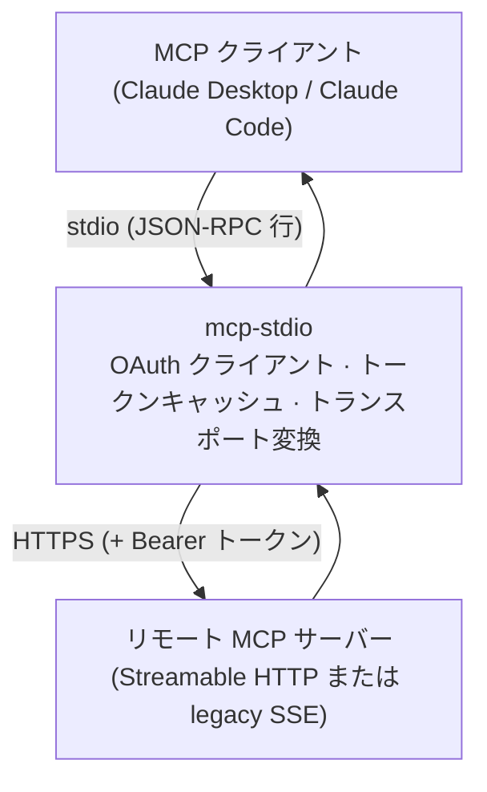
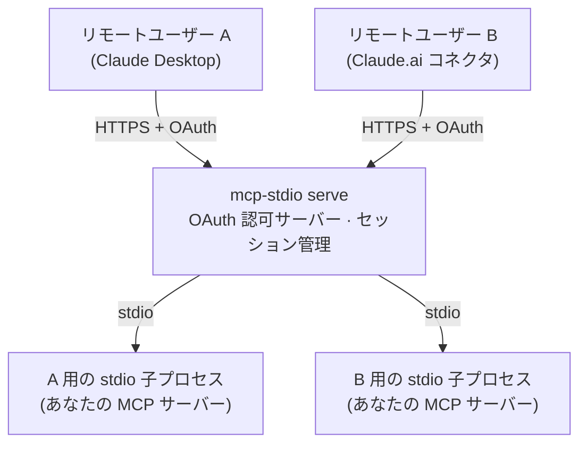
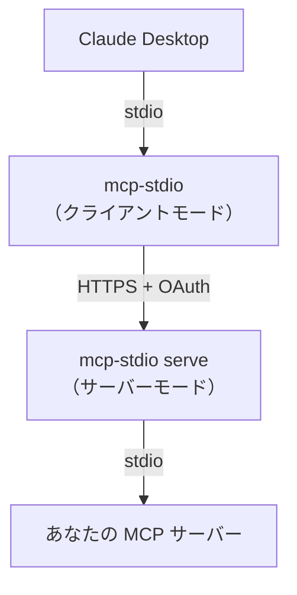

# ふたつの使い方

mcp-stdio はひとつのコマンドにふたつの明確に異なる役割があります。この
ドキュメントの残り全部がこの選択にぶら下がっているので、まずここで
整理してください。

|  | **クライアント側ゲートウェイ**（デフォルト） | **サーバーゲートウェイ**（`serve`） |
|---|---|---|
| あなたは… | 誰かのリモート MCP サーバーを*使う*側 | 自分の MCP サーバーを*公開する*側 |
| MCP サーバーの居場所 | どこか別の場所、HTTPS の向こう | あなたのマシン上、stdio で動作 |
| mcp-stdio の居場所 | MCP クライアントの隣（手元のマシン） | MCP サーバーの隣（公開ホスト） |
| 変換の向き | stdio → Streamable HTTP / SSE | Streamable HTTP → stdio |
| OAuth での役割 | **クライアント**：ログインし、トークンを保存・リフレッシュ | **認可サーバー**：クライアントを登録し、トークンを発行・検証 |
| 典型的な利用者 | Claude Desktop / Claude Code でリモートサーバーを使う人 | stdio MCP サーバーをリモートユーザーに届けたい運用者 |
| 次に読む | [リモート MCP サーバーに接続する](guides/connect-remote.md) | [stdio サーバーを公開する](guides/serve.md) |

## クライアント側ゲートウェイとして（デフォルトモード）

MCP クライアント（Claude Desktop、Claude Code など）はローカルの stdio
プロセスしか起動できませんが、使いたいサーバーはネットワークの向こうに
あります。mcp-stdio がそのローカルプロセス*そのもの*になります：
クライアントは mcp-stdio と stdio で会話し、mcp-stdio がすべての
メッセージを HTTPS でリモートサーバーへ中継します——OAuth ログイン、
トークンキャッシュ、リフレッシュを引き受けるので、接続はアクセス
トークンの寿命より長生きします。



```bash
mcp-stdio --oauth https://mcp.example.com/mcp
```

このモードが欲しくなるのは：

- ベンダーやチームがホストする MCP サーバーを Claude Desktop / Claude
  Code から使いたいとき；
- クライアント単体では完結できない OAuth ログインをサーバーが要求する
  とき；
- クライアントが対応をやめた legacy SSE トランスポートをサーバーが
  まだ話しているとき。

→ **[リモート MCP サーバーに接続する](guides/connect-remote.md)** へ。

## サーバーゲートウェイとして（`serve` モード）

手元のマシンで stdio を話す MCP サーバーを書いた（または動かしている）。
それをリモートユーザーが*彼らの* MCP クライアントから使えるようにしたい。
`mcp-stdio serve` はそれを本物の Streamable HTTP エンドポイントにします：
片側で HTTPS を受け、もう片側では**ユーザーセッションごとに**隔離された
stdio 子プロセスを spawn し、`--enable-oauth` を付ければクライアント登録と
トークン発行を担う OAuth 2.1 認可サーバーとしてすべてを守ります。



```bash
mcp-stdio serve --enable-oauth \
  --public-url https://mcp.example.com \
  --token-store /var/lib/mcp-stdio/state.json \
  -- python -m my_mcp_server
```

このモードが欲しくなるのは：

- MCP サーバーが stdio 専用で、リモートクライアントから届かせたいとき；
- 複数ユーザーがひとつのデプロイを**プロセスを共有せずに**使う必要が
  あるとき——各セッションが専用の子プロセスを持ち、認証済みユーザーに
  束縛されます；
- 前段に本物の OAuth が必要だが、エンドポイントひとつのために Keycloak
  を立てたくはないとき。

→ **[stdio サーバーを公開する](guides/serve.md)** へ。

<a id="protocol-eras"></a>

## 新しい MCP（2026-07-28）のサーバーを使う

**普段は何もしなくて構いません。** mcp-stdio はこれまでどおりの話し方で
サーバーとやりとりするので、バージョンを上げても挙動は変わりません。

新しい MCP 仕様（2026-07-28）で作られたサーバーにつなぐときは、
フラグをひとつ足すだけで、あとは mcp-stdio が判断します。

```bash
mcp-stdio --protocol-era auto https://mcp.example.com/mcp
```

MCP クライアント側——Claude Desktop でも Claude Code でも——の設定変更は
一切要りません。クライアントは今までどおりの話し方のままで、あいだを
mcp-stdio が通訳します。

### いま、どちらで話しているか

起動時に stderr へ出ます。

```
[mcp-stdio] protocol era: modern (auto-detected)
```

| 表示 | 意味 |
|---|---|
| `protocol era: modern (auto-detected)` | 相手は新しいサーバーで、新しいプロトコルで話している |
| `protocol era: legacy (auto-detected)` | 相手は従来のサーバー。これまでと何も変わらない |
| 何も出ない | `--protocol-era` を付けていないので、従来のプロトコル |

### フラグの選び方

| 値 | こんなとき |
|---|---|
| `legacy`（**デフォルト**） | とくに気にしないとき。これまでとまったく同じ挙動 |
| `auto` | 相手がどちらか分からないとき。起動時に一度だけ尋ねて自動判別する |
| `modern` | 新しいサーバーだと分かっていて、尋ねる手間を省きたいとき |

`auto` は起動時にリクエストが 1 回だけ増えます。デフォルトにしていない
理由はそれだけです。

!!! note "古い SSE トランスポートでは効きません"
    `--protocol-era` はデフォルトのトランスポート専用です。
    `--transport sse` では無視され、その旨が表示されます。

    ```
    warning: --protocol-era auto is ignored on --transport sse
    (always the pre-Streamable-HTTP legacy transport)
    ```

### 新しいサーバー相手に mcp-stdio が代わりにやること

気づかないのが理想ですが、中で何が変わっているか気になる方へ。

- **ツール・リソース・プロンプトはこれまでどおり使えます。** 新しい仕様は
  クライアントとサーバーの自己紹介のしかたを組み替えました。その両側を
  mcp-stdio が引き受けます。
- **通知もちゃんと届きます。** 新しいサーバーは長時間つなぎっぱなしの
  経路で通知を送ってくるので、mcp-stdio がその接続を保持します。購読中の
  リソースの更新も同じ経路で届きます。
- **サーバーからの問い合わせも動きます。** 処理の途中でサーバーが確認や
  入力を求めてきたとき、mcp-stdio はそれをクライアントが表示できる
  いつもの形に変換し、あなたの答えを持って元の処理を続けます。
- **キャンセルが本当に止まります。** これまでは応答を握りつぶすだけでしたが、
  いまはサーバー側の処理そのものを中断します。ただし途中で打ち切れない
  場面もわずかにあります——リクエストとほぼ同時にキャンセルが届いた場合、
  応答を返し始める前に処理を終えてしまうサーバー、長いページ分割の一覧の
  取得中。その場合でも応答は破棄されるので、キャンセルした結果が
  表示されることはありません。

### `serve` で自分のサーバーを公開する場合

`mcp-stdio serve` は同じアドレスで新旧どちらのクライアントにも応答します。
あなたの stdio サーバーはどちらが来たかを知る必要がありません。

```bash
mcp-stdio serve -- python -m my_mcp_server
```

- **新しいクライアント**はハンドシェイクもセッションも使わずに接続し、
  mcp-stdio があなたのサーバーに代わって応答します。結果をどれくらい
  キャッシュしてよいかも含めて返します
  （[`--cache-ttl-ms`](reference.md#modern-era-serve) で調整可能）。
- **従来のクライアント**はこれまでとまったく同じで、セッションごとに
  隔離された子プロセスがつきます。

新しいクライアント向けには、認証ユーザーごとに 1 つ（認証なしで動かして
いる場合は共有の 1 つ）あなたのサーバーを起動します。そうしたクライアント
には、プロセスを紐づけるためのセッションが無いからです。

!!! note "現時点では未対応"
    新しいクライアントが `serve` にリアルタイム通知の経路を要求した場合、
    黙って無視せず「未実装」と明示して返します。
    [#374](https://github.com/shigechika/mcp-stdio/issues/374) で対応予定。

## 両方いっぺんに

ふたつの役割は組み合わせられます。よくあるパターン：運用者が社内サーバー
を `serve` で公開し、チームの全員が手元のラップトップからクライアント
モードの mcp-stdio で接続する——両端で同じパッケージが、それぞれ OAuth の
自分の側を担当します。


