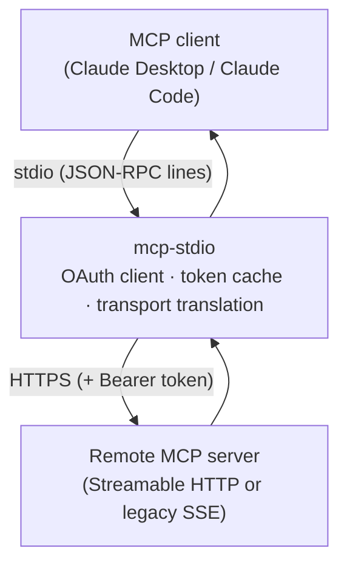
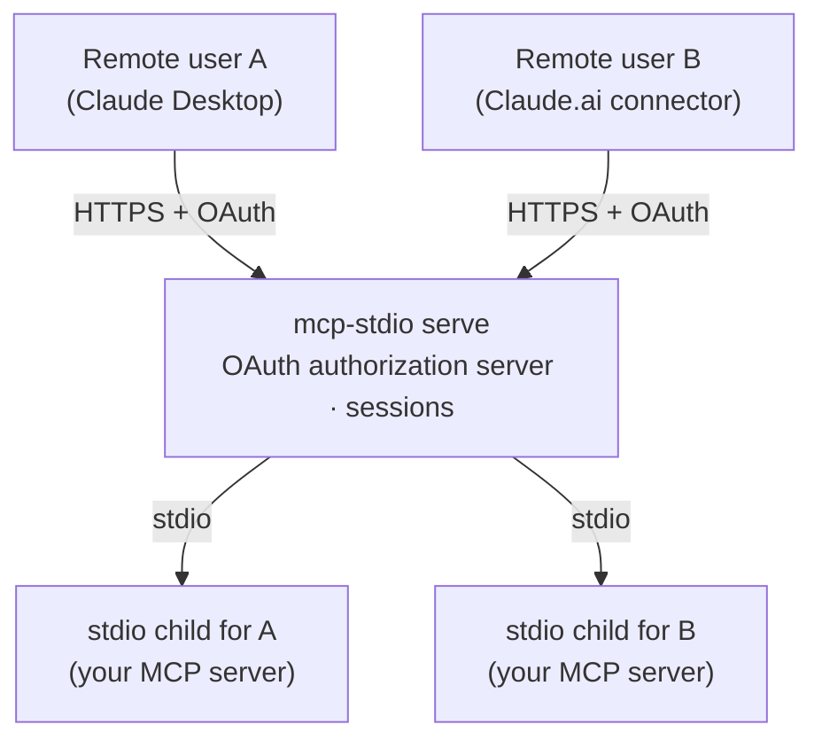
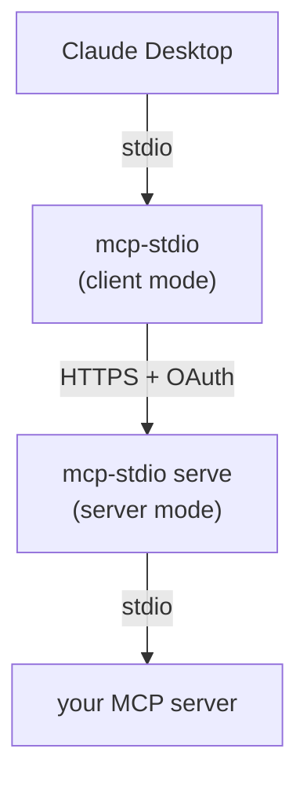

# Two ways to use it

mcp-stdio is one command with two distinct roles. Everything else in these
docs hangs off this choice, so take a moment here.

|  | **As a client-side gateway** (default) | **As a server gateway** (`serve`) |
|---|---|---|
| You are… | *using* someone's remote MCP server | *publishing* your own MCP server |
| Your MCP server runs… | somewhere else, behind HTTPS | on your machine, speaking stdio |
| mcp-stdio runs… | next to your MCP client (laptop) | next to your MCP server (host) |
| It translates… | stdio → Streamable HTTP / SSE | Streamable HTTP → stdio |
| OAuth role | **client**: logs in, stores and refreshes your tokens | **authorization server**: registers clients, issues and validates tokens |
| Typical user | anyone using Claude Desktop / Claude Code with a remote server | the operator of a stdio MCP server that remote users should reach |
| Start here | [Connect to a remote MCP server](guides/connect-remote.md) | [Publish your stdio server](guides/serve.md) |

## As a client-side gateway (default mode)

Your MCP client (Claude Desktop, Claude Code, …) only launches local stdio
processes, but the server you want lives on the network. mcp-stdio *is* that
local process: your client talks stdio to it, and it relays every message to
the remote server over HTTPS — handling the OAuth login, token cache, and
refresh so the connection survives longer than an access token does.



```bash
mcp-stdio --oauth https://mcp.example.com/mcp
```

You want this mode when:

- a vendor / your team hosts an MCP server and you want it in Claude
  Desktop or Claude Code;
- the server needs an OAuth login your client cannot complete on its own;
- the server still speaks the legacy SSE transport your client dropped.

→ Continue with **[Connect to a remote MCP server](guides/connect-remote.md)**.

## As a server gateway (`serve` mode)

You wrote (or run) an MCP server that speaks stdio on your machine, and
remote users should reach it from *their* MCP clients. `mcp-stdio serve`
turns it into a proper Streamable HTTP endpoint: it accepts HTTPS on one
side, spawns an isolated stdio child process **per user session** on the
other, and — with `--enable-oauth` — acts as the OAuth 2.1 authorization
server that registers clients and issues the tokens guarding it all.



```bash
mcp-stdio serve --enable-oauth \
  --public-url https://mcp.example.com \
  --token-store /var/lib/mcp-stdio/state.json \
  -- python -m my_mcp_server
```

You want this mode when:

- your MCP server is stdio-only and remote clients need to reach it;
- several users must share one deployment **without** sharing a process —
  each session gets its own child, bound to its authenticated user;
- you need real OAuth in front of it but do not want to run Keycloak for a
  single endpoint.

→ Continue with **[Publish your stdio server](guides/serve.md)**.

<a id="protocol-eras"></a>

## Protocol eras (MCP 2026-07-28)

MCP changed shape in spec revision **2026-07-28**. mcp-stdio calls the two
shapes *eras*, and both faces of the gateway speak both:

| | **legacy** (2025-06-18 and earlier) | **modern** (2026-07-28) |
|---|---|---|
| Handshake | `initialize` + `notifications/initialized` | none — the server is asked `server/discover` instead |
| State | an `Mcp-Session-Id` ties requests together | none; every request stands alone |
| Per-request metadata | negotiated once at `initialize` | `_meta` in the body plus `Mcp-Method` / `Mcp-Name` headers on every request |
| Server → client requests | sent directly on the connection | replaced by *multi round-trip requests* (MRTR) |

### Client mode: `--protocol-era`

```bash
mcp-stdio --protocol-era auto https://mcp.example.com/mcp
```

| Value | What happens |
|---|---|
| `legacy` (**default**) | today's behaviour, byte for byte — no probe, no extra request |
| `auto` | one `server/discover` probe before the stdin loop starts, then whichever era the answer indicates |
| `modern` | forced; no probe of the answer's era, though the probe still runs to collect the server's capabilities |

`legacy` is the default deliberately: an unmodified deployment's wire
traffic must not change when you upgrade mcp-stdio. `auto` costs exactly
one extra HTTP request at startup, which is why it is opt-in.

If the probe cannot confirm a modern server, `auto` falls back to
`legacy` and says so on stderr (`protocol era: legacy (auto-detected)`).

!!! note "SSE transport ignores this flag"
    `--protocol-era` applies to Streamable HTTP only. Under
    `--transport sse` it is ignored with a warning — that transport *is*
    the pre-Streamable-HTTP legacy one:

    ```
    warning: --protocol-era auto is ignored on --transport sse
    (always the pre-Streamable-HTTP legacy transport)
    ```

### What the modern client path does for you

Your MCP client keeps speaking its own 2025-06-18 dialect throughout —
mcp-stdio does the translating. On the modern era it additionally:

- **answers `initialize` locally.** A modern server has no handshake, so
  the relay synthesises the `InitializeResult` from what `server/discover`
  reported, and never forwards your client's `initialize` upstream.
- **stamps every request** with the `_meta` block and the
  `Mcp-Method` / `Mcp-Name` headers the revision requires, and sends no
  `Mcp-Session-Id` at all.
- **holds background `subscriptions/listen` streams** so server
  notifications still reach your client. A second, dedicated stream
  carries `resources/subscribe` — your client's `resources/subscribe` and
  `resources/unsubscribe` calls are answered locally and translated into
  that stream's filter, because the modern revision removed those methods
  from the wire.
- **bridges MRTR.** When a server answers a `tools/call` with
  "I need input first", the relay turns each request in it back into the
  `elicitation/create` / `sampling/createMessage` / `roots/list` your
  client already understands, collects the answers, and retries the
  original call — so a 2025-era client transparently completes an
  exchange designed after it. Opt out of *advertising* the capability
  with `MCP_STDIO_MRTR_STRIP=1`.
- **honours cancellation for real.** On this transport, closing the
  response stream *is* the cancel signal — no `notifications/cancelled`
  is sent upstream. A cancel from your client aborts the matching
  in-flight request instead of merely suppressing its late answer.

    There are three windows where a cancel still cannot cut a request
    short, all of them narrow and none of them a regression (before this,
    the modern era honoured no cancel at all): a cancel that arrives
    before the relay has picked the request up; a server that does all its
    work *before* sending response headers, since there is no open stream
    to close yet; and a request being auto-paginated. In every case the
    cancel is still tracked, so a late answer is dropped before it reaches
    your client.

### Serve mode is dual-era

`mcp-stdio serve` answers whichever era the caller uses, on the same
endpoint, and your stdio server never has to know:

- **A modern client** gets `server/discover` answered by the gateway
  (from a handshake it performed with your child process on the client's
  behalf), then dispatches `tools/list`, `tools/call` and the rest
  statelessly — no session is minted and none is echoed back, even if the
  caller sends one. Results are **stamped** on the way out with the
  fields the revision requires: `resultType`, plus `ttlMs` / `cacheScope`
  caching hints on the six cacheable operations (see
  [`--cache-ttl-ms`](reference.md#modern-era-2026-07-28)).
- **A legacy client** keeps exactly the behaviour it always had:
  `initialize` mints an `Mcp-Session-Id`, one child process per session,
  `GET` for the SSE stream, `DELETE` to terminate.

Modern requests are served from gateway-owned child processes keyed on
the **authenticated principal** — one shared child with no auth or a
static token, one per OAuth user — rather than per session, since a
stateless client has no session to key on.

!!! warning "Not served yet: `subscriptions/listen`"
    Serve does not implement the modern notification stream, so a
    `subscriptions/listen` request is answered `404` with JSON-RPC
    `-32601` (method not found) rather than being silently accepted.
    Tracked in
    [#374](https://github.com/shigechika/mcp-stdio/issues/374).

## Both at once

The two roles compose. A common pattern: an operator publishes an internal
server with `serve` on one host, and every team member connects to it with
plain client-mode mcp-stdio from their laptop — the same package on both
ends, each side doing its half of the OAuth dance.


