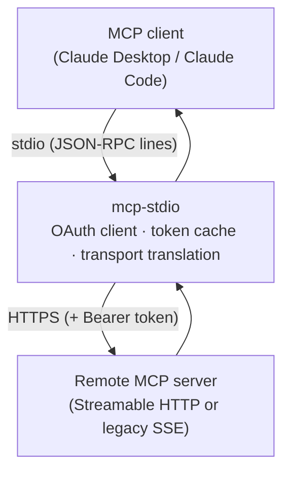
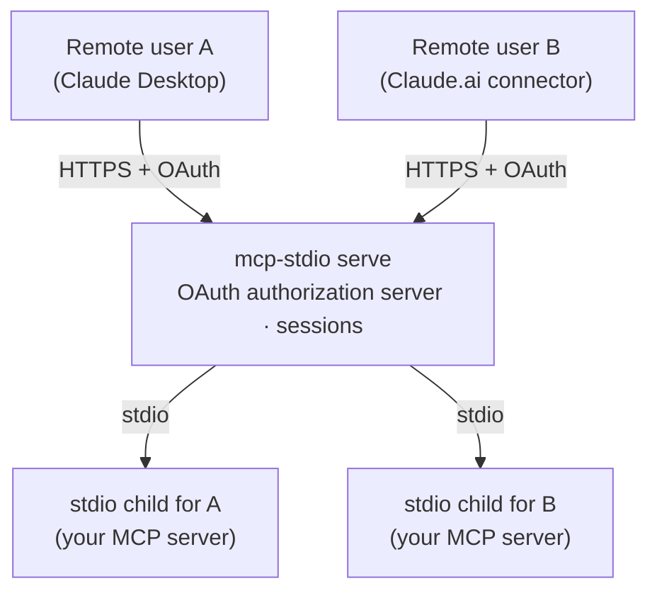
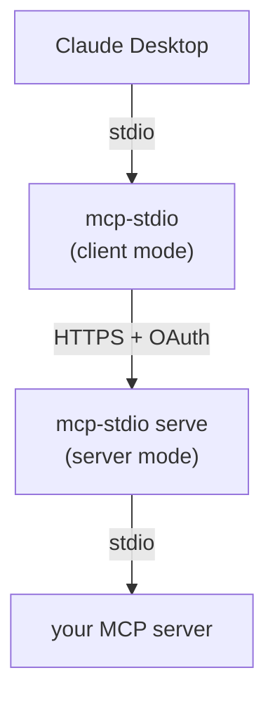

# Two ways to use it

mcp-stdio is one command with two distinct roles. Everything else in these
docs hangs off this choice, so take a moment here.

|  | **As a client-side gateway** (default) | **As a server gateway** (`serve`) |
|---|---|---|
| You are… | *using* someone's remote MCP server | *publishing* your own MCP server |
| Your MCP server runs… | somewhere else, behind HTTPS | on your machine, speaking stdio |
| mcp-stdio runs… | next to your MCP client (laptop) | next to your MCP server (host) |
| It translates… | stdio → Streamable HTTP / SSE | Streamable HTTP → stdio |
| OAuth role | **client**: logs in, stores and refreshes your tokens | **authorization server**: registers clients, issues and validates tokens |
| Typical user | anyone using Claude Desktop / Claude Code with a remote server | the operator of a stdio MCP server that remote users should reach |
| Start here | [Connect to a remote MCP server](guides/connect-remote.md) | [Publish your stdio server](guides/serve.md) |

## As a client-side gateway (default mode)

Your MCP client (Claude Desktop, Claude Code, …) only launches local stdio
processes, but the server you want lives on the network. mcp-stdio *is* that
local process: your client talks stdio to it, and it relays every message to
the remote server over HTTPS — handling the OAuth login, token cache, and
refresh so the connection survives longer than an access token does.



```bash
mcp-stdio --oauth https://mcp.example.com/mcp
```

You want this mode when:

- a vendor / your team hosts an MCP server and you want it in Claude
  Desktop or Claude Code;
- the server needs an OAuth login the client itself fumbles;
- the server still speaks the legacy SSE transport your client dropped.

→ Continue with **[Connect to a remote MCP server](guides/connect-remote.md)**.

## As a server gateway (`serve` mode)

You wrote (or run) an MCP server that speaks stdio on your machine, and
remote users should reach it from *their* MCP clients. `mcp-stdio serve`
turns it into a proper Streamable HTTP endpoint: it accepts HTTPS on one
side, spawns an isolated stdio child process **per user session** on the
other, and — with `--enable-oauth` — acts as the OAuth 2.1 authorization
server that registers clients and issues the tokens guarding it all.



```bash
mcp-stdio serve --enable-oauth \
  --public-url https://mcp.example.com \
  --token-store /var/lib/mcp-stdio/state.json \
  -- python -m my_mcp_server
```

You want this mode when:

- your MCP server is stdio-only and remote clients need to reach it;
- several users must share one deployment **without** sharing a process —
  each session gets its own child, bound to its authenticated user;
- you need real OAuth in front of it but do not want to run Keycloak for a
  single endpoint.

→ Continue with **[Publish your stdio server](guides/serve.md)**.

## Both at once

The two roles compose. A common pattern: an operator publishes an internal
server with `serve` on one host, and every team member connects to it with
plain client-mode mcp-stdio from their laptop — the same package on both
ends, each side doing its half of the OAuth dance.


