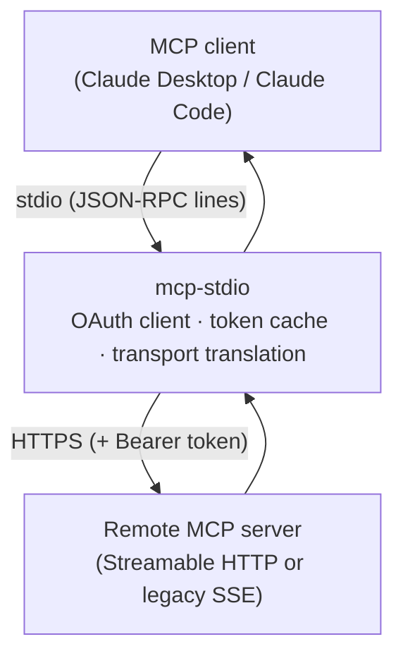
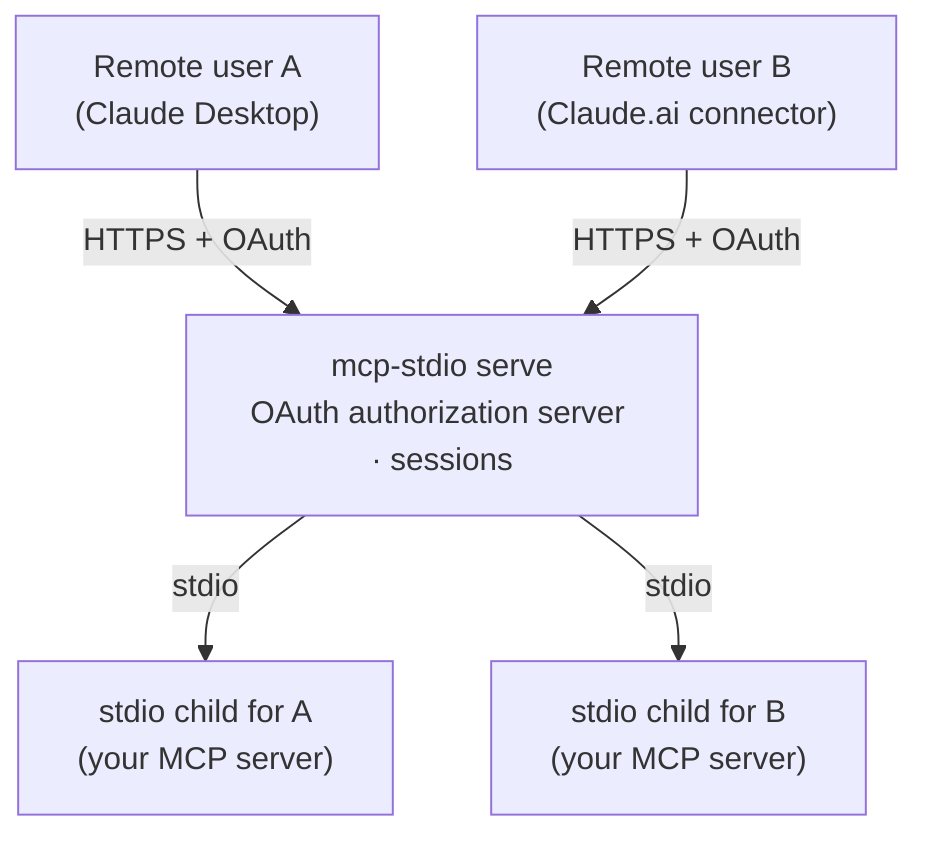
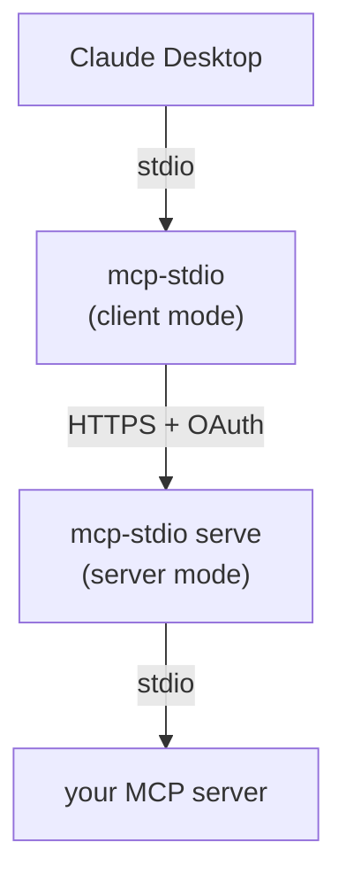

# Two ways to use it

mcp-stdio is one command with two distinct roles. Everything else in these
docs hangs off this choice, so take a moment here.

|  | **As a client-side gateway** (default) | **As a server gateway** (`serve`) |
|---|---|---|
| You are… | *using* someone's remote MCP server | *publishing* your own MCP server |
| Your MCP server runs… | somewhere else, behind HTTPS | on your machine, speaking stdio |
| mcp-stdio runs… | next to your MCP client (laptop) | next to your MCP server (host) |
| It translates… | stdio → Streamable HTTP / SSE | Streamable HTTP → stdio |
| OAuth role | **client**: logs in, stores and refreshes your tokens | **authorization server**: registers clients, issues and validates tokens |
| Typical user | anyone using Claude Desktop / Claude Code with a remote server | the operator of a stdio MCP server that remote users should reach |
| Start here | [Connect to a remote MCP server](guides/connect-remote.md) | [Publish your stdio server](guides/serve.md) |

## As a client-side gateway (default mode)

Your MCP client (Claude Desktop, Claude Code, …) only launches local stdio
processes, but the server you want lives on the network. mcp-stdio *is* that
local process: your client talks stdio to it, and it relays every message to
the remote server over HTTPS — handling the OAuth login, token cache, and
refresh so the connection survives longer than an access token does.



```bash
mcp-stdio --oauth https://mcp.example.com/mcp
```

You want this mode when:

- a vendor / your team hosts an MCP server and you want it in Claude
  Desktop or Claude Code;
- the server needs an OAuth login your client cannot complete on its own;
- the server still speaks the legacy SSE transport your client dropped.

→ Continue with **[Connect to a remote MCP server](guides/connect-remote.md)**.

## As a server gateway (`serve` mode)

You wrote (or run) an MCP server that speaks stdio on your machine, and
remote users should reach it from *their* MCP clients. `mcp-stdio serve`
turns it into a proper Streamable HTTP endpoint: it accepts HTTPS on one
side, spawns an isolated stdio child process **per user session** on the
other, and — with `--enable-oauth` — acts as the OAuth 2.1 authorization
server that registers clients and issues the tokens guarding it all.



```bash
mcp-stdio serve --enable-oauth \
  --public-url https://mcp.example.com \
  --token-store /var/lib/mcp-stdio/state.json \
  -- python -m my_mcp_server
```

You want this mode when:

- your MCP server is stdio-only and remote clients need to reach it;
- several users must share one deployment **without** sharing a process —
  each session gets its own child, bound to its authenticated user;
- you need real OAuth in front of it but do not want to run Keycloak for a
  single endpoint.

→ Continue with **[Publish your stdio server](guides/serve.md)**.

<a id="protocol-eras"></a>

## Working with MCP 2026-07-28 servers

**Usually you do not have to do anything.** mcp-stdio keeps talking to
servers the way it always has, so upgrading changes nothing.

If you connect to a server built for the newer MCP spec (2026-07-28), add
one flag and mcp-stdio figures the rest out:

```bash
mcp-stdio --protocol-era auto https://mcp.example.com/mcp
```

Your MCP client — Claude Desktop, Claude Code, anything else — needs no
changes at all. It keeps speaking the dialect it already knows, and
mcp-stdio translates.

### Which one am I getting?

mcp-stdio prints the answer to stderr as it starts:

```
[mcp-stdio] protocol era: modern (auto-detected)
```

| What you see | What it means |
|---|---|
| `protocol era: modern (auto-detected)` | the server is a new one, and mcp-stdio is using the new protocol |
| `protocol era: legacy (auto-detected)` | the server is an older one — nothing changes |
| nothing printed | you did not pass `--protocol-era`, so the old protocol is in use |

### The flag

| Value | When to use it |
|---|---|
| `legacy` (**default**) | you don't think about it; behaves exactly as before |
| `auto` | you don't know what the server is — mcp-stdio asks it once at startup and picks |
| `modern` | you know the server is a new one and want to skip the extra question |

`auto` costs one extra request when mcp-stdio starts. That is the only
reason it is not the default.

!!! note "Not for the old SSE transport"
    `--protocol-era` only applies to the default transport. With
    `--transport sse` it is ignored, and mcp-stdio tells you so:

    ```
    warning: --protocol-era auto is ignored on --transport sse
    (always the pre-Streamable-HTTP legacy transport)
    ```

### What mcp-stdio does for you against a new server

You should not notice any of this — that is the point — but if you are
wondering what changed under the hood:

- **Tools, resources and prompts work as usual.** The newer spec
  reorganised how a client and server introduce themselves, and mcp-stdio
  handles both sides of that.
- **Notifications still arrive.** Newer servers deliver them over a
  long-lived connection that mcp-stdio holds open for you, including
  updates for resources you subscribed to.
- **Prompts back to you still work.** When a server needs to ask you
  something mid-call — a confirmation, a piece of text, permission to
  sample — mcp-stdio turns that into the ordinary request your client
  already knows how to show you, then continues the original call with
  your answer.
- **Cancelling actually stops the work.** Pressing escape now aborts the
  request on the server instead of just hiding the reply. A few cases
  still cannot be cut short mid-flight — a cancel that arrives in the same
  instant as the request, a server that does all its work before it starts
  replying, and long paginated lists — and in those the reply is still
  discarded, so you never see a result you cancelled.

### Publishing your own server with `serve`

`mcp-stdio serve` handles both kinds of client on the same address, and
your stdio server does not need to know which is which:

```bash
mcp-stdio serve -- python -m my_mcp_server
```

- **A newer client** connects without a handshake and without a session,
  and mcp-stdio answers on your server's behalf — including how long
  results may be cached (tune with
  [`--cache-ttl-ms`](reference.md#modern-era-serve)).
- **An older client** works exactly as it always has, with its own
  isolated child process per session — unless you pass `--modern-only`,
  which turns older clients away instead.

For newer clients, mcp-stdio starts one copy of your server per
authenticated user (or a single shared one if you run without
authentication), because those clients have no session to tie a process to.

<a id="listchanged-serve"></a>

#### Telling clients your lists changed

If your server announces that its tools, prompts or resources changed,
newer clients now hear about it. They open one long-lived connection and
mcp-stdio pushes your server's announcements down it as they happen —
your stdio server keeps sending the same notifications it always did, and
nothing about it changes.

Four announcements travel this way:

| What your server sends | What the client does |
|---|---|
| `notifications/tools/list_changed` | re-fetches your tool list |
| `notifications/prompts/list_changed` | re-fetches your prompt list |
| `notifications/resources/list_changed` | re-fetches your resource list |
| `notifications/resources/updated` | re-reads that one resource |

A client asks for the ones it cares about and gets only those. It may
keep up to four such connections open at once; a fifth is refused rather
than queued.

If mcp-stdio is shut down, the client is told the stream is over and does
not try to reconnect. If your server process dies instead, the stream
just drops — which tells the client to reconnect and re-fetch, because
mcp-stdio itself is still there.

#### Watching individual resources

The last row works a little differently, because the client names
*which* resources it wants to watch rather than just switching a
notification on.

**Your server needs to declare `resources.subscribe`.** If it does,
mcp-stdio subscribes on the client's behalf — it sends your server the
ordinary `resources/subscribe` it already understands, and forwards the
resulting `notifications/resources/updated` to whichever clients asked
for that URI. If your server does *not* declare it, mcp-stdio says so
in its reply and never sends a subscription your server cannot serve.

Worth knowing:

- **Your server is told once per resource, however many clients are
  watching it.** mcp-stdio counts the watchers and unsubscribes only
  when the last one goes away.
- **URIs are matched exactly.** `file:///a` and `file:///a/` are two
  different subscriptions, because there is no way to ask your server
  which spelling it means.
- **Up to 256 resources per connection.** Ask for more and mcp-stdio
  keeps the first 256 and tells the client exactly which ones it got.
- **The reply does not wait for your server.** mcp-stdio answers the
  client immediately and subscribes in the background, so a slow server
  cannot stall the connection. The trade-off is that a subscription your
  server rejects is logged rather than reported back — the client is
  told it is watching, and simply never sees an update.

!!! note "Not supported: log messages"
    mcp-stdio never sends `notifications/message` on these connections.
    The spec forbids it there, and the logging feature is deprecated as
    of MCP 2026-07-28, so this is a permanent decision rather than a
    gap.

<a id="mid-call-serve"></a>

#### Answering your server's mid-call questions

If your server is still on an older protocol version but wants to ask
something *during* a call it is handling — elicit input, request a
sampling completion, or list the client's roots — a newer client can
answer it, over MRTR — the reverse direction of the same multi
round-trip pattern that [`MCP_STDIO_MRTR_STRIP`](reference.md#env-vars)
lets you escape on the client side.

**Off by default**, behind `MCP_STDIO_MRTR_REVERSE_ENABLE`
([reference](reference.md#env-vars)). With it unset,
mcp-stdio tells your server up front that it cannot ask, and a
well-behaved server never does. Turning it on is a real, observable
handshake change on every child process mcp-stdio spawns, so an
operator withdraws it the same way it was granted — by unsetting the
variable and restarting.

**OAuth-authenticated callers only.** A caller with no session — no
auth, or a shared static token — cannot be told apart from any other
caller, and answering the wrong one's prompt would be worse than
refusing. Those callers keep today's behavior even with the flag on:
your server's question gets `-32601`, exactly as if it had never
asked.

What the client sees: the call it made comes back as an
`input_required` result instead of the answer it expected, carrying
your server's question and an opaque `requestState`. It answers by
retrying the *same* request with `inputResponses` and that
`requestState` attached. mcp-stdio delivers the answer to your server
and, once your server finishes handling it, returns the original
result on that retry.

Worth knowing:

- **One eligible call in flight per child at a time.** A second
  `tools/call`, `resources/read`, or `prompts/get` on the same child
  while one is already parked waiting for its answer gets a `503` —
  the caller retries once the parked one resolves.
- **The client is not required to come back.** If it never retries,
  mcp-stdio eventually gives up and answers your server's question
  with an error rather than leaving it blocked forever.
- **Only three requests bridge**: `elicitation/create`,
  `sampling/createMessage`, `roots/list`. Anything else your server
  raises mid-call still gets the `-32601` it always would.

## Both at once

The two roles compose. A common pattern: an operator publishes an internal
server with `serve` on one host, and every team member connects to it with
plain client-mode mcp-stdio from their laptop — the same package on both
ends, each side doing its half of the OAuth dance.


